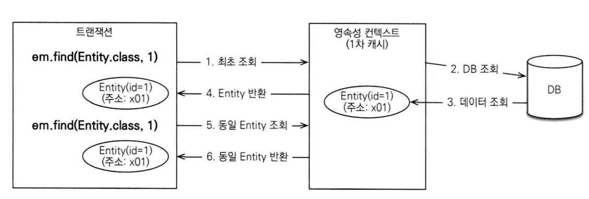
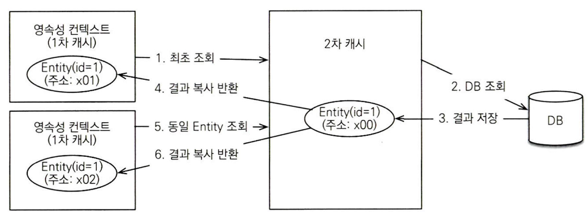

# 16장 정리
프로젝트를 진행하며 동시성 문제를 해결하기 위해서 해당 장을 먼저 진행하였습니다

## 이번장에서 진행할 내용

- 16.1 : 트랜잭션과 락
- 16.2 : 2차 캐시

## 16.1 트랜잭션과 락

트랜잭션 기초와 JPA가 제공하는 낙관적 락과 비관적 락에 대해 진행한다

### 트랜잭션과 격리 수준

- 트랜잭션은 ACID라 하는 원자성, 일관성, 격리성, 지속성을 보장해야한다
    - 원자성 : 트랜잭션 내에서 실행한 작업들은 마치 하나의 작업 처럼 모두 성공 or 모두 실패 해야한다
    - 일관성 : 모든 트랜잭션은 일관성 있는 데이터베이스 상태를 유지해야한다 ex) 데이터베이스에서 정한 무결성 제약 조건을 항상 만족해야 한다
    - 격리성 : 동시에 실행되는 트랜잭션들이 서로에게 영향을 미치지 않도록 격리한다 ex) 동시에 같은 데이터를 수정하지 못하도록 한다
    - 지속성 : 트랜잭션을 성공적으로 끝내면 그 결과가 항상 기록되어야 한다 ex) 중간에 시스템에 문제가 생겨도 데이터베이스 로그 등을 사용해서 성공한 트랜잭션 내용을 복구 해야한다

### 문제 상황(4단계의 격리 수준을 정의한 이유)

트랜잭션은 원자성, 일관성, 지속성을 보장한다 하지만 격리성의 경우 완벽히 보장하려면 트랜잭션을 거의 차례대로 실행해야한다 → 이럴경우 동시성 처리 성능이 매우 나빠진다

- 따라서 ANSI표준은 트랜잭션의 격리 수준을 4단계로 나누어 정의

### 4단계의 격리 수준

- READ UNCOMMITED(커밋되지 않은 읽기)
- READ COMMITTED(커밋된 읽기)
- REPEATABLE READ(반복 가능한 읽기)
- SERIALIZABLE(직렬화 가능)

아래로 갈 수록 격리 수준이 높다

격리 수준이 낮을 수록 → 동시성은 증가 + 이에 따른 문제 발생

### 발생 가능한 문제들

- DIRTY READ
    - 데이터를 수정하는 도중 수정된 데이터를 조회
- NON-REPEATABLE READ(반복 불가능한 읽기)
    - 데이터를 처음 조회 후 그 사이 데이터를 수정했을때 다른 데이터가 조회
- PHANTOM READ
    - 데이터를 반복 조회 시 데이터가 추가되어 결과 집합이 달라지는것

- READ UNCOMMITED
    - 커밋하지 않은 데이터를 읽을 수 있다
    - ex) 트랜잭션1이 데이터를 수정하고 커밋하지 않은 시점에 트랜잭션2가 데이터를 조회할 수 있다 :DIRTY READ
    - 이때 트랜잭션2가 읽은 데이터를 사용하고 트랜잭션1이 롤백을 해서 원래 데이터로 돌아간다면 정합성에 문제가 발생
    - DIRTY READ를 허용하는게 READ UNCOMMITED다
- READ COMMITED
    - 커밋된 데이터만 읽을 수 있다
    - 따라서 DIRTY READ는 발생하지 않는다
    - 하지만 NON-REPEATABLE READ가 발생
    - ex) 트랜잭션1이 조회 중 트랜잭션2가 데이터를 수정하고 커밋하면 트랜잭션1이 다시 조회를 했을때 수정된 데이터가 조회
- REPEATABLE READ
    - 한 번 조회한 데이터를 반복해서 조회해도 같은 데이터가 조회된다
    - 하지만 이때는 PHANTOM READ가 발생한다
    - ex) 트랜잭션1이 10살 이하 데이터를 조회 후 트랜잭션2가 데이터를 추가 → 다시 트랜잭션1이 조회 하면 추가된 데이터가 같이 조회되는 문제
- SERIALIZABLE
    - 가장 엄격한 트랜잭션 격리 수준
    - PHANTOM READ가 발생하지 않는다
    - 하지만 동시성 처리 성능이 급격히 떨어진다

### 정리

애플리케이션 대부분은 동시성 처리가 중요하므로 데이터베이스들은 보통 READ COMMITED 격리 수준을 기본으로 사용한다

## 낙관적 락과 비관적 락

- JPA는 데이터베이스 트랜잭션 격리 수준을 READ COMMITED 정도로 가정한다
- 만약 더 높은 격리 수준이 필요하면 낙관적 락과 비관적 락 중 하나를 사용하면 된다

### 낙관적 락

- 정의 : 트랜잭션 대부분은 충돌이 발생하지 않는다고 가정하는 방법
- 동작 : 데이터베이스가 제공하는 락 기능이 아닌 JPA가 제공하는 버전 관리 기능을 사용
- 특징
    - 트랜잭션을 커밋하기 전까지는 트랜잭션의 충돌을 알 수 없다
    - `@Version` 어노테이션을 사용해서 버전 관리
        - 엔티티를 수정할 때 마다, 값이 1씩 증가, 커밋 시점에 조회 시점과 값이 다르면 예외 발생

### 비관적 락

- 정의 : 트랜잭션의 충돌이 발생한다고 가정하고 우선 락을 걸고 보는 방법
- 동작 : 데이터베이스가 제공해주는 락 기능을 사용
- 특징 : 대표적으로 `select for update` 구문

### 두 번의 갱실 분실 문제(Second Lost Updates Problem)

- 문제  상황 : 동시에 수정화면을 열어서 사용자 A가 수정후 완료, 잠시후 사용자B도 수정 완료 → 결과적으로 제일 마지막에 수정한 사용자B의 수정사항만 반영되는 문제
- 즉 사용자 A의 수정사항은 사라지고 나중에 완료한 사용자B의 수정사항만 남는 문제

### 이럴 경우 해결 방법 3가지

1. 마지막 커밋만 인정 : 마지막 커밋인 사용자B 내용만 인정
2. 최초 커밋 인정 : 사용자A가 먼저 수정했으므로 사용자B가 수정하면 오류 발생
3. 충돌하는 갱신 내용 병합 : 사용자A와 사용자B 내용을 병합한다

### 정리

- 기본적으로는 마지막 커밋만 인정하기가 사용된다
- 낙관적 락의 `@Version`을 사용하면 처음 커밋 인정이 된다
    - 왜냐? 처음 커밋후에는 버전이 증가되어 있으니 뒤에 트랜잭션 시작한
- 비관락의 경우 동시 update 충돌 방지 → 따라서 화면에서 읽어온 오래된 값을 동시에 수정하면 마지막으로 수정한 값이 결과가 된다

## JPA 락 사용

- READ COMMITTED 트랜잭션 격리 수준 + 낙관적 락을 권장
- 사용 위치
    - EntityManager.lock(), EntityManager.find(), EntityManager.refresh(), Query.setLockMode(), @NamedQuery

## JPA + 낙관적 락

- @Version을 사용
- 트랜잭션을 커밋하는 시점에 충돌을 감지
- 락 옵션
    - NONE - 엔티티에 @Version이 적용된 필드가 있다면 낙관적 락이 적용된다
        - 동작 : 엔티티를 수정할 때 버전을 체크
    - OPTIMISTIC - 엔티티를 조회만 해도 버전을 체크한다
        - 동작 : 조회시점부터 트랜잭션이 끝날때 까지 조회한 결과가 변하지 않아야 한다 → DIRTY READ, NON-REPEATABLE READ를 방지
    - OPTIMISTIC_FORCE_INCREMENT
        - 상황 : 게시글 + 첨부파일 엔티티 연관 관계 상황에서 첨부파일만 추가되면 게시글의 버전은 증가하지 않는다 하지만 게시글의 버전도 강제로 증가시키는 방식
        - 이점 : 강제로 버전을 증가 → 논리적인 단위의 엔티티 묶음을 버전으로 관리

## JPA + 비관적 락

- 데이터베이스 트랜잭션 락에 의존
- 특징
    - 락을 획득할 때까지 트랜잭션이 대기한다
    - 무한정 기다릴 수는 없으니 타임아웃 시간을 설정 가능하다
- 종류
    - PESSIMISTIC_WRITE
        - 비관락이라하면 보통 이 옵션
        - 데이터베이스 쓰기에 락을 건다
        - select for update를 사용하여 락
    - PESSIMISTIC_READ
        - 데이터를 반복 읽기만 하고 수정하지 않는 용도
    - PESSIMISTIC_FORCE_INCREMENT
        - 비관락중 유일하게 버전 정보를 사용

## 16.2 2차 캐시
## 1차 캐시와 2차 캐시

- 네트워크를 통해 데이터베이스에 접근하는 시간 비용은 애플리케이션 서버에서 내부 메모리에 접근하는 시간 비용보다 수십만 배 이상 비싸다
- 영속성 컨텍스트 자체가 1차캐시
- 1차 캐시로도 이점이 많지만, 2차캐시를 통해 DB접근 횟수를 더 획기적으로 줄일 수 있다
- 범위
    - 1차 캐시 - 영속성 컨텍스트 범위
    - 2차 캐시 - 애플리케이션 범위 (애플리케이션 종료까지 캐시 유지)

### 1차 캐시

<p align="left">
    
</p>

1. 엔티티 매니저로 조회하거 변경하면 모든 엔티티는 1차 캐시에 저장
2. 트랜잭션 커밋 or 플러시 → 1차 캐시에 변경 내용을 DB에 반영
- 1차 캐시는 끄고 켤 수 있는 옵션이 아니다

### 2차 캐시

- 애플리케이션에서 공유하는 캐시를 2차 캐시라고 한다

<p align="left">
    
</p>

- 2차 캐시를 적용할 경우 데이터를 조회할때 방식
1. 영속성 컨텍스트는 엔티티가 필요하면 바로 DB조회가 아닌 2차 캐시를 조회
2. 2차 캐시에도 없을 경우에 DB를 통해서 조회 후 2차 캐시에 보관
3. 2차 캐시에서는 자신이 보관하고 있는 엔티티를 복사해서 반환

### 기억해야할 점

- 2차 캐시는 조회한 객체를 그대로 반환이 아닌 복사본을 만들어서 반환
- 2차 캐시는 영속성 유닛 범위의 캐시
- 2차 캐시는 데이터베이스 기본 키를 기준으로 캐시하지만 영속성 컨텍스트가 다르다면 객체 동일성(a==b)는 보장하지 않는다

### 2차 캐시 설정 방법

```java
@Cacheable
@Entity
@Cache(usage = CacheConcurrencyStrategy.READ_WRITE)
public class Member {
...
@Cache(usage = CacheConcurrencyStrategy.READ_WRITE)
@OneToMany(mappedBy = "parentMember", cascade = CascadeType.ALL)
...
}
```

- `@Cacheable` - 설정을 하지 않으면 기본값은 true
- `@Cache` - 캐시를 할때 세밀한 설정을 할때 사용한다
    - usage : 캐시 동시성 전략을 설정, 사용 가능한 설정은 아래와 같다
        - NONE - 캐시를 설정하지 않는다
        - READ_ONLY - 읽기 전용
        - NONSTRICT_READ_WRITE - 엄격하지 않은 읽고 쓰기 전략
        - READ_WRITE - 읽기 쓰기가 가능, READ COMMITTED 정도의 격리수준
        - TRANSACTIONAL - 컨테이너 관리 환경에서 사용가능, REPEATABLE READ 정도의 격리 수준

## 나만의 정리

- 이번 프로젝트를 진행하며 포인트 충전, 결제, 정산을 진행하게 된다 따라서 동시성 문제 해결이 필요했고 이책을 읽고 문제 상황을 정리해 보았다
- 우선 서버(JVM)단의 서버락은 배포환경에서 다중 인스턴스 환경에서 적용이 안되므로 디비락을 고려하였다
- 포인트 충전과 결제가 동시에 일어난다면? 비관락? 낙관락?
- 비관락
    - 포인트 충전 트랜잭션 시작 → 포인트 레코드에 락 → 포인트 충전, 포인트 결제는 대기 상태 → 락 해제 → 포인트 결제 트랜잭션 시작 → 포인트 레코드에 락 → 락 해제
    - 이렇게 비관락을 적용하여 포인트 잔액이 꼬이지 않고 진행 가능
- 낙관락
    - 포인트 충전 트랜잭션 시작 → 포인트 레코드에 락 → 포인트 충전 + 버전 증가 + 결제 대기 → 결제 시도 → 버전 불일치 예외 발생 → 결제는 재시도 로직
    - 즉 낙관적 락을 사용할 경우 충돌 감지 + 재시도 로직이 추가로 필요해진다
- 2차 캐시
    - DB에 바로 접근하는 비용 > 메모리에 접근하는 비용은 인지하고 있었지만 `@Cachable` 어노테이션을 통해 2차 캐시를 적용하고 `@Cache` 어노테이션을 통해 캐시 옵션 설정 방법을 알게 되었다 이를 적용할 수 있는 부분을 찾아보고 2차 캐시의 유의점을 고려하여 프로젝트에 적용시켜봐야겠다 생각했다