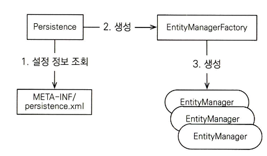

# 2장 정리

### 2장에서는 프로젝트 세팅, JPA동작 방식, 실습을 진행

책에서는 라이브러리를 메이븐을 사용하여 관리하지만 좀 더 익숙한 gradle로 라이브러리를 관리하고 db는 기존에 설치되어있는 mysql을 사용하여 진행

JPA 구현체로 하이버네이트를 사용하기 위한 핵심 라이브러리

- hibernate-core : 하이버네이트 라이브러리
- hibernate-entityManager : 하이버네이트가 JPA 구현체로 동작하도록 JPA 표준을 구현한 라이브러리
- hibernate-jpa-2.1-api : JPA 2.1 표준 API를 모아둔 라이브러리

mysql db 세팅

```sql
CREATE TABLE MEMBER (
ID VARCHAR (255) NOT NULL,
NAME VARCHAR (255) ,
AGE INTEGER,
PRIMARY KEY (ID)
)
```

java Member 엔티티 클래스

```java
@Entity
@Table(name = "MEMBER")
public class Member {
    @Id
    @Column(name = "ID")
    private String id;
    @Column(name = "NAME")
    private String username;
    private Integer age;
}
```

- @Entity : 이 클래스를 테이블과 매핑한다고 JPA에게 전달
- @Table : 엔티티 클래스에 매핑할 테이블 정보 - (생략할 경우 클래스 이름을 테이블 이름으로 매핑한다)
- @Id : 엔티티 클래스의 필드를 테이블의 기본 키에 매핑한다
- @Column : 필드를 컬럼에 매핑한다
    - 코드에서는 username 필드를 name 컬럼에 매핑한다
- 매핑 정보가 없는필드는 → 필드명을 기준으로 컬럼명으로 매핑한다

작성한 persistence.xml

```java
<?xml version="1.0" encoding="UTF-8"?>
<persistence xmlns="https://jakarta.ee/xml/ns/persistence" version="3.0">
    <persistence-unit name="JavaOrmApplication">
        <class>org.example.javaorm.Member</class>

        <properties>
            <!-- JDBC -->
            <property name="jakarta.persistence.jdbc.driver" value="com.mysql.cj.jdbc.Driver"/>
            <property name="jakarta.persistence.jdbc.url" value="jdbc:mysql://localhost:3306/orm?serverTimezone=UTC"/>
            <property name="jakarta.persistence.jdbc.user" value="root"/>
            <property name="jakarta.persistence.jdbc.password" value=""/>

            <!-- Hibernate -->
            <property name="hibernate.dialect" value="org.hibernate.dialect.MySQL8Dialect"/>
            <property name="hibernate.hbm2ddl.auto" value="update"/>
            <property name="hibernate.show_sql" value="true"/>
        </properties>
    </persistence-unit>
</persistence>
```

### JPA 구동 방식
<p align="left">
    
</p>

```java
    public static void main(String[] args) {
        //엔티티 매니저 팩토리 - 생성
        EntityManagerFactory emf = Persistence.createEntityManagerFactory("JavaOrmApplication");
        //엔티티 매니저 -생성
        EntityManager em = emf.createEntityManager();
        // 트랜잭션 획득
        EntityTransaction tx = em.getTransaction();

        try {
            tx.begin(); //트랜잭션 -시작
            logic(em); //비즈니스 로직 실행
            tx.commit(); //트랜잭션 -커밋
        } catch (Exception e) {
            tx.rollback(); // 트랜잭션 롤백
        } finally {
            em.close(); //엔티티 매니저 -종료
        }
        emf.close(); //엔티티 매니저 팩토리 -종료
    }
```

### 엔티티 매니저 팩토리

- JPA를 시작하려면 우선 persistence.xml의 설정 정보를 사용해서 엔티티 매니저 팩토리를 생성한다

  이때 persistence 클래스를 사용하는데 이 클래스는 엔티티 매니저 팩토리를 생성해서 JPA를 사용할 수 있게 준비한다

- 엔티티 메니저 팩토리는 애플리케이션 전체에서 딱 한번만 생성하고 공유해서 사용해야한다
    - 이유는 엔티티 매니저 팩토리는 persistence.xml의 설정 정보를 읽어서 JPA를 동작시키기 위한 기반 객체를 만들고 JPA 구현체에 따라 데이터베이스 커넥션 풀도 생성하므로 엔티티 매니저 팩토리를 생성하는 비용이 크기 때문이다

### 엔티티 매니저

- 팩토리를 통해 생성
- 엔티티 매니저를 통해서 엔티티를 데이터베이스에 등록/수정/삭제/조회 가능하다
- 데이터 베이스 커넥션과 밀접한 관계가 있으므로 스레드간에 공유하거나 재사용하면 안된다

### 실습 - 회원 저장

```java
    public static void main(String[] args) {
        //엔티티 매니저 팩토리 - 생성
        EntityManagerFactory emf = Persistence.createEntityManagerFactory("JavaOrmApplication");
        //엔티티 매니저 -생성
        EntityManager em = emf.createEntityManager();
        // 트랜잭션 획득
        EntityTransaction tx = em.getTransaction();

        tx.begin();
        Member member = new Member();
        member.setId(1L);
        member.setName("HelloA");
        em.persist(member);
        tx.commit();
        em.close();
        emf.close();

    }
```

- 엔티티를 저장하려면 엔티티 매니저의 persist() 메서드에 저장할 엔티티를 넘겨주면된다

### 실습 - 회원 조회

```java
    public static void main(String[] args) {
        //엔티티 매니저 팩토리 - 생성
        EntityManagerFactory emf = Persistence.createEntityManagerFactory("JavaOrmApplication");
        //엔티티 매니저 -생성
        EntityManager em = emf.createEntityManager();
        // 트랜잭션 획득
        EntityTransaction tx = em.getTransaction();
        tx.begin();

        try {
            Member findMember = em.find(Member.class, 1L);
            System.out.println("findMember id = " + findMember.getId());
            System.out.println("findMember name = " + findMember.getName());

            tx.commit();
        } catch (Exception e) {
            tx.rollback();
        } finally {
            em.close();
        }
        emf.close();

    }
```

- 엔티티 매니저의 find를 통해서 조회

### 실습 - 회원 삭제

```java
    public static void main(String[] args) {
        //엔티티 매니저 팩토리 - 생성
        EntityManagerFactory emf = Persistence.createEntityManagerFactory("JavaOrmApplication");
        //엔티티 매니저 -생성
        EntityManager em = emf.createEntityManager();
        // 트랜잭션 획득
        EntityTransaction tx = em.getTransaction();
        tx.begin();

        try {
            Member findMember = em.find(Member.class, 1L);
            em.remove(findMember);

            tx.commit();
        } catch (Exception e) {
            tx.rollback();
        } finally {
            em.close();
        }
        emf.close();
    }
```

- 엔티티 매니저의 remove를 통하여 삭제

### JPQL

JPA는 SQL을 추상화한 JPQL이라는 객체지향 쿼리 언어를 제공한다

SQL과의 차이점
- JPQL은 엔티티 객체를 대상으로 쿼리
- SQL은 데이터베이스 테이블을 대상으로 쿼리

특징
- SQL과 유사 문법을 지원
- 테이블이 아닌 객체를 대상으로 검색하는 **객체 지향 쿼리**