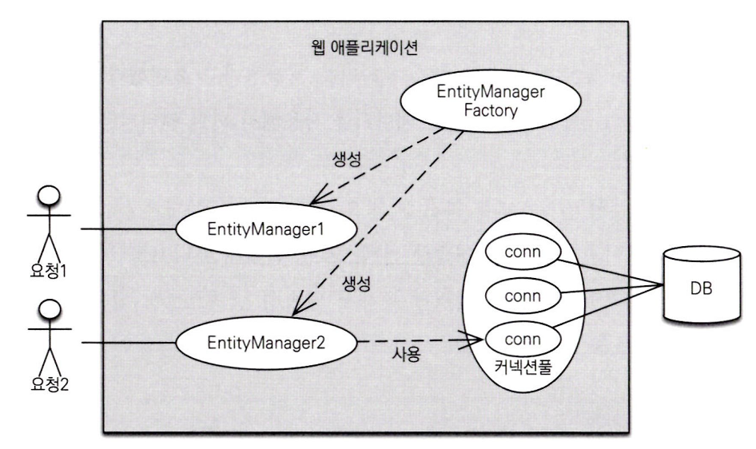
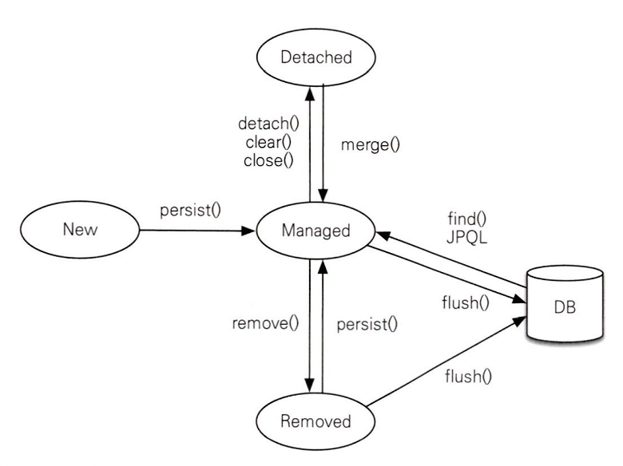
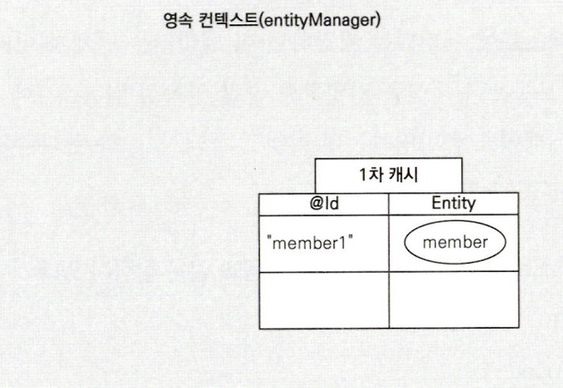
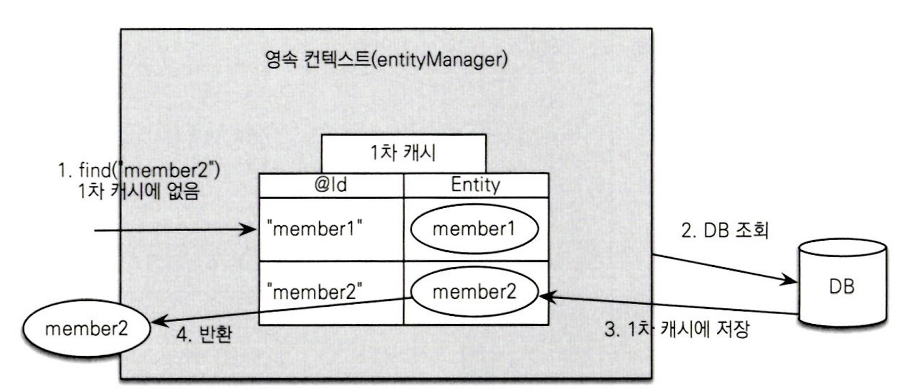
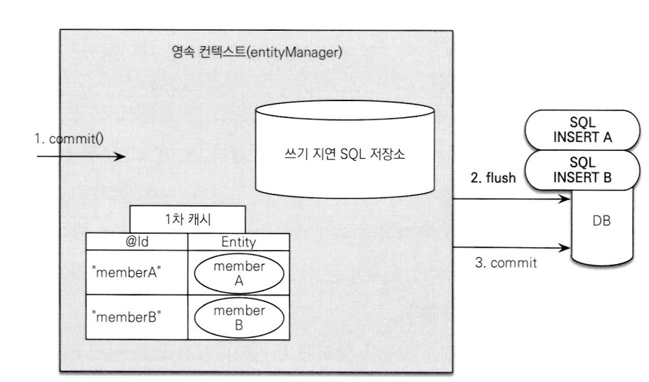
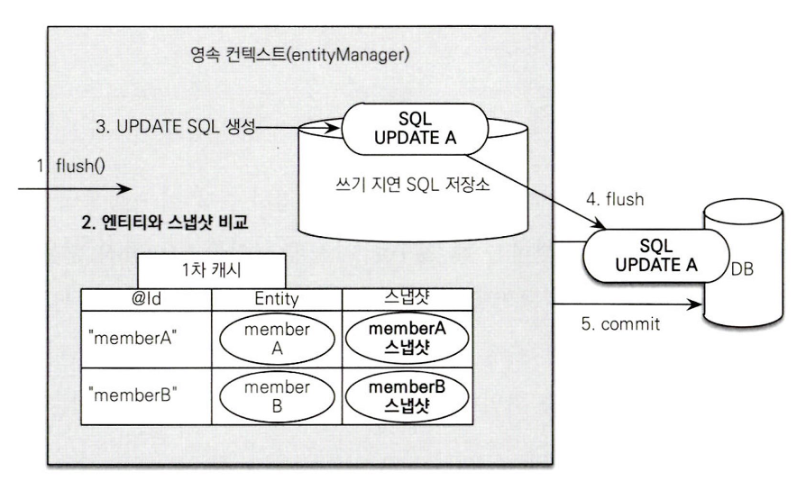

# 3장 정리
### 3장에서는 영속성 관리에 대해서 배운다

매핑한 엔티티를 엔티티 매니저를 통해 어떻게 사용되는지 알아본다

<p align="left">
    
</p>

`EntityManagerFactory` :

- 이름 그대로 엔티티 매니저를 만드는 공장인데, 공장을 만드는 비용이 상당히 크다
- 여러 스레드가 동시에 접근해도 안전

`EntityManager` :

- 반면 엔티티 매니저를 생성하는 비용은 거의 들지 않는다
- 여러 스레드가 접근하면 동시성 문제가 발생하므로 스레드 간에 절대 공유해서는 안된다
- 데이터베이스 연결이 꼭 필요한 시점까지 커넥션을 얻지 않는다
    - 트랜잭션 시작시점에 커넥션을 얻는다

### 영속성 컨텍스트

- JPA를 이해하는데 가장 중요한 단어
- 우리말로 표현하면 “엔티티를 영구 저장하는 환경”
- 엔티티 매니저로 저장하거나 조회하면 엔티티 매니저는 영속성 컨테스트에 엔티티를 보관하고 관리한다

기존 코드를 보자

```java
em.persist(member)
```

이 코드는 단순 회원 엔티티를 저장한다고 표현했지만

조금더 정확히 표현하면 **엔티티 매니저를 사용하여 회원 엔티티를 영속성 컨텍스트에 저장한다** 라고 한다

### 엔티티의 생명주기
<p align="left">
    
</p>


엔티티에는 총 4가지 상태가 존재한다

- 비영속(new) : 영속성 컨텍스트와는 관계가 없는 상태
- 영속(managed) : 영속성 컨텍스트에 저장된 상태
- 준영속(detached) : 영속성 컨텍스트에 저장되었다가 분리된 상태
- 삭제(removed) : 삭제된 상태

### 비영속

```java
//객체를 생성만 한 상태(비영속)
Member member = new Member();
member.setId("member1");
member.setUsername("회원1");
```

- 순수한 객체 상태이며 객체를 저장하지 않은 상태(em.persist()를 호출하기 전)

### 영속

```java
//객체를 저장한 상태(영속)
em.persist(member);
```

- 이렇게 영속성 컨텍스트가 관리하는 엔티티를 영속상태라 한다
- 즉, 영속성 컨텍스트에 의해 관리된다는 뜻이다

### 준영속

```java
em.detach(member);
```

- 영속상태로 관리되던 엔티티를 detach()를 호출하면 준영속 상태가 되는데
- 준영속 상태: 영속성 컨텍스트가 관리하지 않는 상태를 말하며
- em.close() or em.clear()를 통해 영속성 컨텍스트를 닫거나 초기화를 해도 영속성 컨텍스트가 관리하던 영속 상태의 엔티티는 준영속 상태가 된다

### 삭제

```java
em.remove(member);
```

- 엔티티를 영속성 컨텍스트와 데이터베이스에서 삭제한다

### 영속성 컨텍스트의 특징

- 영속성 컨텍스트는 엔티티를 식별자 값(@Id로 테이블의 기본키)로 구분한다 따라서 영속 상태는 식별자 값이 반드시 있어야 한다
- 영속성 컨텍스트에 엔티티를 저장하면 해당 엔티티는 언제 데이터베이스에 저장될까?

  → 보통 JPA는 트랜잭션을 커밋하는 순간 연속성 컨텍스트에 새로 저장된 엔티티를 데이터베이스에 반영하는데 이것을 **플러시** 라고 한다

- 영속성 컨텍스트가 엔티티를 관리하면 이점
    - 1차 캐시
    - 동일성 보장
    - 트랜잭션을 지원하는 쓰기 지연
    - 변경 감지
    - 지연 로딩

### 1차 캐시 (read)

- 영속성 컨텍스트는 내부에 캐시를 가지고 있는데 이것을 1차 캐시라고 한다
- 영속 상태의 엔티티는 모두 이곳에 Map 형태로 저장된다

```java
Member member = new Member();
member.setId("member1");
member.setUsername("회원1");

//엔티티를 영속
em.persist(member);
```

이 코드를 실행하면 그림처럼 1차 캐시에 회원 엔티티를 저장한다


<p align="left">
    
</p>

이후에

```java
Member findMember = em.find(Member.class, "member1");
```

find(엔티티 클래스의 타입, “조회할 엔티티의 식별자 값”); 으로 구성되고

em.find를 호출하면 먼저 1차캐시에서 엔티티를 찾고 없다면 DB에서 조회한다

<p align="left">
    
</p>

- 만약 1차 캐시에 엔티티 정보가 없다면 DB에서 조회 후 엔티티를 생성하고 해당 엔티티를 1차 캐시에 저장한 후에 영속 상태의 엔티티를 반환한다

### 그러면 이제 어느시점에 INSERT SQL을 DB에 보내는가?(create)

```java
EntityManager em = emf.createEntityManager();
EntityTransaction transaction = em.getTransaction();
//엔티티 매니저는 데이터 변경 시 트랜잭션을 시작한다
transaction.begin(); //트랜잭션 시작

em.persist(memberA);
em.persist(memberB);
//여기까지도 INSERT SQL을 데이터베이스에 보내지 않는다

//커밋하는 순간 DB에 INSERT SQL을 보낸다
transaction.commit(); //트랜잭션 커밋
```

<p align="left">
    
</p>

1. 엔티티 매니저는 트랜잭션을 커밋하기 직전까지 데이터베이스에 엔티티를 저장하지 않고 내부 쿼리 저장소에 INSERT SQL을 모아둔다
2. 트랜잭션 커밋할때 모아둔 쿼리를 데이터베이스에 보내는데 이것을 트랜잭션을 지원하는 **쓰기 지연**이다

<p align="left">
    
</p>

- 해당 그림은 쓰기지연을 통해 2개의 SQL문이 지연쓰기 저장소에 존재하다가 → 커밋 시점에 DB에 INSERT SQL을 보내는데 이때 엔티티 매니저는 영속성 컨텍스트를 **플러시** 한다

- 뒤에서 자세하게 나오지만 간단하게만 보면 플러시란?
    - 플러시는 영속성 컨텍스트의 변경 내용을 DB에 동기화하는 작업인데 이때 등록, 수정, 삭제한 엔티티를 DB에 반영한다 (쓰기 지연 SQL 저장소에 모인 쿼리를 데이터베이스에 보낸다)

### 변경 감지 (update)

- 엔티티의 데이터만 변경했는데 어떻게 DB에 반영이 되는걸까?
- 엔티티의 변경사항을 데이터베이스에 자동으로 반영하는 기능을 **변경 감지** 라고 한다

<p align="left">
    
</p>

- JPA는 엔티티를 영속성 컨텍스트에 보관할 때, 최초 상태를 복사해서 저장하는데 이걸 스냅샷이라고 한다
- 데이터 변경 시점에 이전에 말했던것처럼 엔티티 매니저가 플러시를 진행하는데 이 시점에 스냅샷과 변경된 엔티티를 비교해서 변경된 엔티티를 찾는다
- 변경 감지는 영속성 컨텍스트가 관리하는 영속 상태의 엔티티에만 적용된다

### 엔티티 삭제(delete)

```java
Member memberA = em.find(Member.class, "memberA");
em.remove(memberA);
```

- 엔티티 등록과 비슷하게 삭제 쿼리를 쓰기 지연SQL 저장소에 등록한다
- 트랜잭션을 커밋하면 플러시를 호출하게 되고 실제 데이터베이스에 삭제 쿼리를 전달한다

### 플러시

- 플러시는 영속성 컨텍스트의 변경 내용을 데이터베이스에 반영한다
- 절대로 영속성 컨텍스트에 보관된 엔티티를 지운다고 생각하면 안된다 → 영속성 컨텍스트의 변경 내용을 데이터베이스에 동기화 하는것이 플러시 이다

- 플러시를 하는 방법은 3가지이다
1. em.flush()를 직접 호출
2. 트랜잭션 커밋 시점에 자동 호출
3. JPQL 쿼리 실행 시 플러시가 자동 호출

- 플러시 모드 옵션
    1. [FlushModeType.AUTO](http://FlushModeType.AUTO) : 커밋이나 쿼리를 실행할 때 플러시(기본값)
    2. FlushModeType.COMMIT : 커밋할 때만 플러시

  대부분 AUTO 자동 커밋시점에 플러시가 되게 사용한다

  COMMIT 모드는 성능 최적화를 위해 사용가능한데 10장에서 다룬다


### 준영속

- 이전까지는 비영속 → 영속 → 삭제 상태를 알아보았다
- 준영속 상태는 영속성 컨텍스트가 관리하는 영속 상태가 아닌 영속성 컨텍스트에서 분리된 상태를 말하는데 이전에 봤던 detach() 된 상태이다
- 준영속 상태의 엔티티는 영속성 컨텍스트가 제공하는 기능을 사용할 수 없다

1. em.detach(entity) : 특정 엔티티만 준영속 상태로 전환한다
2. em.clear(): 영속성 컨텍스를 완전히 초기화
3. em.close():영속성 컨텍스트를 종료

3개모두 준영속 상태를 만드는 명령어이고 차이점이라면

- detach()는 하나만 호출해도 해당 객체는 준영속 상태
- clear() or close()는 여러 개를 한꺼번에 처리할 때 사용되는 방식

```java
//회원 엔티티 생성, 비영속상태
Member member = new Member();
member.setId("memberA");
member.setUsername("회원A");
//회원 엔티티 영속상태
em.persist(member);
//회원 엔티티를 영속성 컨텍스트에서 분리, 준영속 상태
em.detach(member); 

transaction.commit(); //트랜잭션 커밋
```

- em.detach()를 호출하는 순간 1차 캐시부터 쓰기 지연 SQL 저장소까지 해당 엔티티를 관리하기 위한 모든 정보가 제거된다

개발자가 직접 준영속 상태로 만드는 일은 드물기 때문에 이정도만 알면 된다

### 병합

- 준영속 상태의 엔티티를 다시 영속 상태로 변경하려면 병합을 사용해야 한다
- 병합은 파라미터로 넘어온 엔티티의 식별자 값으로 영속성 컨텍스트를 조회하고 찾는 엔티티가 없으면 DB를 조회한다
- 병합은 준영속, 비영속을 신경쓰지 않는다 식별자 값으로 조회할 수 있으면 불러서 병합하고 조회할 수 없으면 새로 생성해서 병합한다

병합 실습 코드

```java
@SpringBootApplication
public class JavaOrmApplication {

    static EntityManagerFactory emf =
            Persistence.createEntityManagerFactory("JavaOrmApplication");

    public static void main(String[] args) {
        Member member = createMember("memberA", "회원1");
        member.setName("회원명 변경");
        mergeMember(member);
    }
    static Member createMember(String id, String name) {
        //영속성 컨텍스트 시작
        EntityManager em1 = emf.createEntityManager();
        EntityTransaction tx1 = em1.getTransaction();
        tx1.begin();

        Member member = new Member();
        member.setId(id);
        member.setName(name);

        em1.persist(member);
        tx1.commit();
        em1.close(); //영속성 컨텍스트 1 종료 -> member 엔티티는 준영속 상태
        //영속성 컨텍스트1 종료
        return member;
    }

    static void mergeMember(Member member) {
        //영속성 컨텍스트 시작
        EntityManager em2 = emf.createEntityManager();
        EntityTransaction tx2 = em2.getTransaction();
        tx2.begin();

        Member mergeMember = em2.merge(member);
        tx2.commit();

        //준영속 상태
        System.out.println("준영속 상태일때 : " + member.getName());

        System.out.println("영속 상태일때 : " + mergeMember.getName());

        System.out.println("em2 contains member = " + em2.contains(member));
        System.out.println("em2 contains mergeMember = " + em2.contains(mergeMember));
        em2.close();
    }
}
```

결과창

```java
준영속 상태일때 : 회원명 변경
영속 상태일때 : 회원명 변경
em2 contains member = false
em2 contains mergeMember = true
```

- 실습을 진행하면서 개인적으로 궁금했던점 정리
    - 왜 준영속 상태인데 username이 변경되는가?

      → member는 JPA입장에서는 준영속 상태이지만 JAVA입장에서는 일반 객체인 상태이다 따라서 java 코드에서 setName()을 하는건 문제가 없다

    - em.contains()?

      → 해당 entity가 현재 EntityManager가 관리하는 영속 상태인지를 boolean으로 반환하는 메서드

- 실습을 통해 알게된점
    - merge()를 통해서 영속성 컨텍스트에 다시 영속상태가 된다

    ```java
    em2 contains member = false
    em2 contains mergeMember = true
    ```

    - 보면 merge()는 준영속 엔티티를 다시 붙이는게 아니라 복사해서 새로운 객체를 만드는것이다
    - 따라서 서로 메모리 주소도 다르다
- 준영속 병합

```java
Member member = createMember("memberA", "회원1");
member.setUsername("회원명변경"); //준영속 상
```

- 비영속 병합

```java
Member member = new Member();
//아직 em.persist()가 없기 때문에 비영속 상태 
Member newMember = em.merge(member);
tx.commit();
```

병합은 비영속  엔티티도 영속 상태로 만들 수 있다

### 나만의 정리

- 엔티티 매니저 팩토리는 생성 비용이 상당히 크고 여러 스레드가 접근해도 안전하기에 공유하여 사용해야 한다
- 반대로 엔티티 매니저는 스레드간 공유해선 안되고 생성 비용이 적다
- 엔티티 매니저는 DB연결이 필요한 시점까지 커넥션을 얻지 않고 트랜잭션 시작 시점에 커넥션을 얻는다
- 영속성 컨텍스트 : 엔티티를 영구 저장하는 환경


- 엔티티의 생명주기는 4가지 상태로 구분
    - 비영속
    - 영속
    - 준영속
    - 삭제


- 영속성 컨텍스트가 엔티티를 관리할때 장점
    - 1차 캐시 - 영속성 컨텍스트에 엔티티를 캐싱
    - 동일성 보장 - 같은 식별자(Id)는 동일성 보장
    - 트랜잭션을 지원하는 쓰기 지연 - 트랜잭션 커밋 시점에 한번에 쿼리실행
    - 변경 감지 - 트랜잭션 커밋 시점에 자동으로 update 쿼리 실행
    - 지연 로딩 - 연관된 엔티티를 실제 사용할때까지 DB조회를 미룸