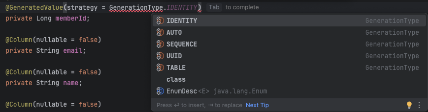

# 4장 정리
이번장에서는 객체와 테이블 매핑, 기본키 매핑, 필드와 컬럼 매핑을 알아본다

### @Entity

- @Entity가 붙은 클래스는 JPA가 관리하는 것으로 엔티티라 부른다

특징은 다음과 같다

1. 기본 생성자는 필수다
2. final 클래스, enum, interface, inner 클래스에는 사용 불가
3. 저장할 필드에 final을 사용하면 안된다

- **JPA는 엔티티 객체를 생성할 때 기본생성자를 사용하므로 필수다**
- 그래서 이전의 경험을 돌아보면 Entity클래스에 항상 @NoArgsConstructor가 존재했던것이다
- 자바의 기본규칙이었던걸 되돌아보면 매개변수 있는 생성자를 정의하면 기본생성자를 만들어주지 않기 때문에 반드시 기본생성자를 만들던가 @NoArgsConstructor를 통해서 만들어야 한다

### @Table

- 엔티티와 매핑할 테이블을 지정한다
- 생략할경우 매핑한 엔티티 이름을 테이블 이름으로 사용한다

### 데이터베이스 스키마 자동 생성

```java
〈property name="hibernate.hbm2ddl.auto" value= "create" />
```

- 이 속성을 추가하면 애플리케이션 실행 시점에 데이터베이스 테이블을 자동으로 생성한다

- hibernate.hbm2ddl.auto속성
  - 

  | 옵션 | 설명 |
      | --- | --- |
  | create | 기존 테이블을 삭제하고 새로 생성한다 DROP + CREATE |
  | create-drop | create 속성에 추가로 애플리케이션 종료시점에 생성한 DDL을 제거한다 DROP + CREATE + DROP |
  | update | 데이터베이스 테이블과 엔티티 매핑정보를 비교해서 변경 사항만 수정한다 |
  | none  | 자동 생성 기능을 사용하지 않는다 |
  | validate | 데이터베이스 테이블과 엔티티 매핑정보를 비교해서 차이가 있으면 경고를 남기고 애플리케이션을 실행하지 않는다 |

```java
<property name="hibernate.show_sql" value="true"/>
```

- hibernate.show_sql 속성의 값을 true로 할 경우 테이블 생성 DDL을 출력한다

### DDL 생성 기능

기존에 Member엔티티의 name컬럼에 not null제약조건과 길이제한속성을 추가한다

```java
@Column(name = "NAME", nullable = false, length = 10)
private String name;
```

- nullable = false :  DDL에 not null 제약조건 추가
- length = 10 : DDL에 문자의 크기를 지정

이 기능들을 통해 개발자가 엔티티만 보고도 손쉽게 다양한 제약조건을 파악가능하다

### 기본 키 매핑

기존의 코드를 살펴보면

```java
    @Id
    @Column(name = "ID")
    private String id;
```

- 이렇게 @Id 어노테이션을 통해서 기본 키를 애플리케이션에 직접 할당했다
- 하지만 이 방식은 애플리케이션에서 직접 할당하는 방식이다
- 이 방식을 **직접 할당** 이라고 한다

- 반대로 자동 생성 방식이 있다

    <p align="left">
    
</p>

    - IDENTITY : 기본 키 생성을 데이터베이스에 위임
    - SEQUENCE : 데이터베이스의 시퀀스를 사용해서 기본 키 할당
    - TABLE : 키 생성 테이블을 사용한다
- 이렇게 다양한 자동 생성전략은 데이터베이스마다 지원하는 방식이 다르기 때문이다
    - mysql을 예로보면 mysql은 시퀀스 기능이 없다보니 기본 키 값을 자동으로 채워주는 AUTO_INCREMENT기능을 제공한다
- 자동 생성전략을 사용하려면 @Id 에 @GeneratedValue를 추가하여 원하는 키 생성전략을 선택하면 된다

다시 직접할당 방식을 조금더 자세히 알아보자

```java
Board board = new Board();
board.setId("id1"); //기본 키 직접 할당
em.persist(board);
```

기본 키 직접 할당 전략은 em.persis()로 엔티티를 저장하기 전에 애플리케이션에서 직접 기본 키를 직접 할당하는 방식이다

### IDENTITY 전략

- IDENTITY는 기본 키 생성을 데이터베이스에 위임하는 전략이다
- 주로 MySQL, PostgreSQL, SQL Server, DB2에서 사용한다
- 데이터베이스에 값을 저장할 때 ID 컬럼을 비워두면 데이터베이스가 순서대로 값을 채워준다

- 사용 방법

    ```java
        @Id
        @GeneratedValue(strategy = GenerationType.IDENTITY)
        @Column(name = "ID")
        private String id;
    ```

- 주의 사항

  IDENTITY는 DB의 auto_increment기능에 의존한다고 했다

  즉, DB에 insert가 실제로 수행돼야 id값을 알 수 있다

  그래서 em.persist()하는 순간 JPA는 해당 insert 쿼리를 즉시 DB에 보낸다 → 영속성 컨텍스트의 쓰기 지연 SQL 저장소를 거치지 않는다

  따라서 이 전략은 트랜잭션을 지원하는 쓰기 지연이 동작하지 않는다


### SEQUENCE 전략

- 데이터베이스 시퀀스는 유일한 값을 순서대로 생성하는 특별한 데이터베이스 오브젝트이다
- 이 전략은 시퀀스를 지원하는 DB인 오라클, PostgreSQL, DB2, H2 데이터베이스에서 사용가능하다

- 사용방법

```java
@SequenceGenerator(
        name = "BOARD_SEQ_GENERATOR",
        sequenceName = "BOARD_SEQ", //매핑할 데이터베이스 시퀀스 이름
        initialValue = 1, allocationSize = 1
)
public class Member {
    @Id
    @GeneratedValue(strategy = GenerationType.SEQUENCE,
    generator = "BOARD_SEQ_GENERATOR")
    @Column(name = "ID")
    private String id;
```

1. 우선 사용할 데이터베이스 시퀀스를 데이터베이스에 만든다
2. 해당 시퀀스를 매핑한다 이때 @SequenceGenerator를 사용한다
3. JPA는 sequenceName에 적힌 실제 데이터베이스에 만들어져 있는 BOARD_SEQ 시퀀스와 매핑한다

시퀀스 사용 코드는 IDENTITY 전략과 같지만 내부 동작 방식이 다르다

- IDENTITY 전략과 차이점
    - SEQUENCE 전략
        - em.persist()를 호출할 때 먼저 **데이터베이스 시퀀스**를 통해서 식별자를 조회한다 그리고 식별자를 엔티티에 할당한 후에 엔티티 영속성 컨텍스트에 저장한다.
        - 이후 트랜잭션을 커밋해서 플러시가 일어나면 엔티티를 데이터베이스에 저장한다
    - IDENTITY 전략
        - 먼저 엔티티를 데이터베이스에 저장한 후 식별자 값을 조호회해서 엔티티 식별자에 할당한다

### TABLE 전략

- 키 생성 전용 테이블을 하나 만들고 여기에 이름과 값으로 사용할 컬럼을 만들어 데이터베이스 시퀀스를 흉내내는 전략
- 테이블을 사용하므로 모든 데이터베이스에 적용가능하다
- TABLE전략은 시퀀스 대신에 테이블을 사용한다는 점만 다르다

예제 코드

```java
@Entity
@TableGenerator(
	name = "BOARD_SEQ_GENERATOR",
	table = "MY_SEQUENCES",
	pkColumnValue = "BOARD_SEQ", allocationSize = 1)
public class Board {

	@Id
	@GeneratedValue(strategy = GenerationType.TABLE,
				generator = "BOARD_SEQ_GENERATOR")
				private Long id;
				...
	}
```

- @TableGenerator를 사용하여 테이블 키 생성기를 등록
- @GeneratedValue.generator를 사용하여 방금 만든 테이블 키 생성기를 지정

### @TableGenerator

| 속성 | 기능 |
| --- | --- |
| name | 식별자 생성기 이름 |
| table | 키생성 테이블 명 |
| pkColumnName | 시퀀스 컬럼명 |

### AUTO 전략

```java
@Id
@GeneratedValue(strategy = GenerationType.AUTO)
private Long id;
```

- AUTO는 선택한 데이터베이스에 따라서 IDENTITY, SEQUENCE, TABLE 전략중 하나를 자동으로 선택한다
- 예를들어 오라클 → SEQUENCE, MySQL → IDENTITY

### 중간 정리 - 기본 키 매핑

- 직접 할당 : em.persist()를 호출하기 전에 애플리케이션에서 직접 식별자 값을 할당
- SEQUENCE : 데이터베이스 시퀀스에서 식별자 값을 획득한 후 영속성 컨텍스트에 저장
- TABLE : 데이터베이스 시퀀스 생성용 테이블에서 식별자 값을 획득한 후 영속성 컨텍스트에 저장
- IDENTITY : 데이터베이스 엔티티를 저장해서 식별자 값을 획득한 후 영속성 컨텍스트에 저장

이번에는 필드와 컬럼에 사용하는 어노테이션을 살펴본다

### @Column

- 객체 필드를 테이블 컬럼에 매핑한다
- 속성값
    - @Column(nullable = false)
    - @Column(unique = true)
    - @Column(columnDefinition = “varchar(100) default ‘EMPTY’”)
    - @Column(length = 400)
    - @Column(precision = 10, scale = 2)

### @Enumerated

- 자바의 enum타입을 매핑할때 사용

```java
enum RoleType {
	ADMIN, USER
}

@Enumerated(EnumType.STRING)
private RoleType roleType;

@Emnumerated(EnumType.ORDINAL)
private RoleType roleType;
```

- EnumType.ORDINAL
    - enum에 정의된 순서대로 ADMIN은 0, USER는 1의 데이터값이 저장된다
    - 장점 : 데이터베이스에 저장되는 데이터 크기가 작다
    - 단점 : 이미 저장된 enum의 순서를 변경할 수 없다
- EnumType.STRING
    - enum에 정의된 이름 그대로 문자형태로 데이터베이스에 저장된다
    - 장점 : 저장된 enum의 순서가 바뀌거나 추가되어도 안전하다
    - 단점 : 저장되는 크기가 ORDINAL에 비해서 크다

기본값인 ORDINAL은 사용할때 주의할점

> 기존 코드처럼 enum에 작성된 ADMIN(0번) USER(1번) 일때 중간에 ADMIN(0번), NEW(1번), USER(2번)로 설정되면 이제부터는 USER는 2로 저장되지만 기존에 저장되었던 값은 여전히 1로 저장이 되어있는 문제가 발생한다
>

따라서 EnumType.STRING을 권장한다

### @Temporal

- 날짜 타입을 매핑할때 사용한다

```java
@Temporal(TemporalType.DATE)
private Date date; //날짜

@Temporal(TemporalType.TIME)
private Date time; //시간

@Temporal(TemporalType.TIMESTAMP)
private Date timestamp; //날짜와 시간
```

### @Lob

- 데이터베이스 BLOB, CLOB 타입과 매핑한다
- @Lob에는 속성을 지정할 수 없다
- 매핑하는 필드 타입이 문자면 CLOB
- 나머지는 BLOB으로 매핑

```java
@Lob
private String lobString;

@Lob
private byte[] lobByte;

//생성된 DDL - mysql 기준
lobString longtext,
lobByte longblob
```

### @Transient

- 이 필드는 매핑하지 않는다
- 주로 객체에 임시로 어떤 값을 보관하고 싶을때 사용한다

### @Access

- JPA가 엔티티 데이터에 접근하는 방식을 지정한다

- 필드 접근 : AccessType.FIELD로 지정, 필드 접근 권한이 private여도 접근가능하다
- 프로퍼티 접근 : [AccessType.PROPERTY](http://AccessType.PROPERTY), 접근자(Getter)를 사용한다

```java
@Entity
@Access(AccessType.FIELD)
public class Member {
	@Id
	private String id;
	...
}
```

- 필드접근이 기본값이기 때문에 생략했을때와 동일하다

```java
@Entity
@Access(AccessType.PROPERTY)
public class Member {
	private Long id;
	private String name;
	
	@Id
	@GeneratedValue
	public Long getId() {
		return id; //JPA가 이 메서드를 통해서 접근
	}
```

- JPA는 Getter를 통해서 접근을 하게 설정한다

### 나만의 정리

- 테이블 매핑
    - @Entity : 테이블과 매핑할 클래스 선언, JPA는 기본 생성자 필수
    - @Table : 엔티티와 매핑할 테이블 지정
- JPA는 데이터베이스 스키마 자동생성한다
    - `spring.jpa.hibernate.ddl-auto=crate/create-drop/update/validate/none`
    - 개발 초기 : create or update
    - 테스트 서버 : update or validate
    - 운영 서버 : validate or none
- 기본키 매핑
    - @Id어노테이션으로 매핑
    - 직접 할당 : em.persist()전에 직접 setId(”id1”) 직접 할당
    - 자동 생성 :
        - IDENTITY - DB에게 기본 키 생성을 위임
        - SEQUENCE - 시퀀스를 활용하여 지정
        - TABLE - 키생성 테이블을 통해서 지정
- 필드 매핑
    - @Column - 필드와 매핑할 테이블의 컬럼지정(생략가능)
        - 여러 속성값 지정가능 (nullable, length …)
    - @Enumerated - enum타입의 필드를 매핑
        - 주로 EnumType.STRING 방식 사용
    - @Temporal - 날짜 타입 매핑시 사용
    - @Lob - 데이터베이스 BLOB,CLOB타입과 매핑
        - BLOB : 이미지 ,동영상,압축파일 등 바이너리 데이터 저장할때
        - CLOB : 수천~ 수만 자 이상의 긴 텍스트 저장시 사용