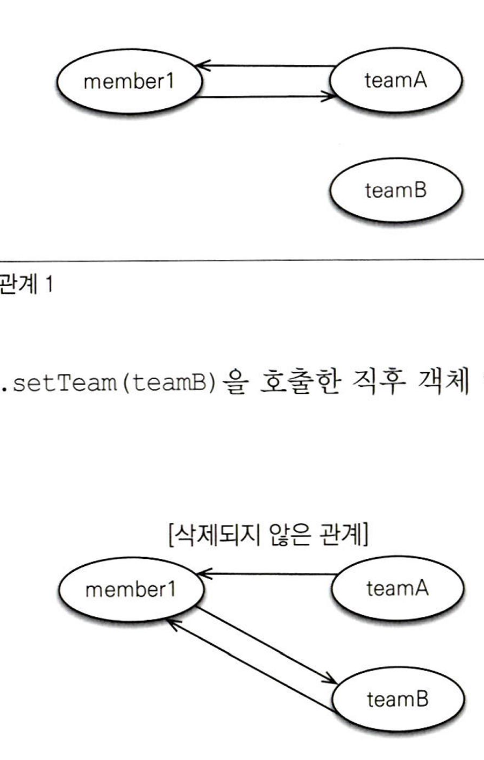

# 5장 정리
### 객체의 참조와 테이블의 외래 키를 매핑하는 것이 이장의 목표다

연관 관계 매핑을 위해서는 **방향**, **다중성**, **연관관계 주인** 에 대한 키워드 이해가 필요하다

1. 방향
    1. 단방향 : 회원 → 팀 or 팀 → 회원 한 쪽만 참조하는 것
    2. 양방향 : 회원 → 팀 and 팀 → 회원 양쪽 모두 서로 참조하는 것
2. 다중성
    1. 다대일(N:1)
    2. 일대다(1:N)
    3. 일대일(1:1)
    4. 다대다(N:M)
        1. ex) 한 팀에 여러 회원이 소속될 수 있으므로 팀과 회원은 일대다 관계이다
3. 연관관계의 주인
    1. 객체를 양방향 연관관계로 만들면 연관관계의 주인을 정해야 한다

객체 연관관계와 테이블 연관관계의 가장 큰 차이

- 객체간에 연관관계를 양방향으로 만들고 싶으면 반대쪽에도 필드를 추가해서 보관해야 한다
- 양방향 관계 = 서로 다른 단방향 관계 2개
    - 객체를 양방향으로 참조하려면 단방향 연관관게를 2개 만들어야 한다

### 엔티티 코드

- Member

```java
@Entity
public class Member {
	@Id
	@Column(name = "MEMBER_ID")
	private String id;
	
	private String username;
	
	@ManyToOne
	@JoinColumn(name="TEAM_ID")
	private Team team;
	
	//연관관계 설정
	public void setTeam(Team team) {
		this.team = team;
	}
}
```

- Team

```java
@Entity
public class Team {

	@Id
	@Column(name = "TEAM_ID")
	private String id;
	
	private String name;
}
```

- 현재는 Member → Team 으로 단방향 매핑을 진행

연관관계 매핑을 위한 어노테이션

- @manyToOne : 다대일(N:1) 관계라는 매핑 정보, 회원과 팀은 다대일 관계다 이렇게 다중성을 나타내는 어노테이션을 필수로 사용해야 한다
- @JoinColumn(name=”TEAM_ID”) : 조인 컬럼은 외래키를 매핑할때 사용한다 name 속성에는 매핑할 외래 키 이름을 지정한다

### 연관관계 조회

방법 2가지

1. 객체 그래프 탐색(객체 연관관계를 사용한 조회)

   객체 크래프 탐색

    ```java
    Member member = em.find(Member.class, "member1");
    Team team = member.getTeam(); //객체 그래프 탐색
    System.out.println("팀이름 = " + team.getName());
    ```

   이처럼 객체를 통해 연관된 엔티티를 조회하는 것을 객체 그래프 탐색이라고 한다

2. 객체지향 쿼리 사용(JPQL)

    ```java
    private static void queryLogicJoin(EntityManager em) {
    	String jpql = "select m from Member m join m.team t where " + 
    		"t.name=:teamName";
    		
    	List<Member> resultList = em.createQuery(jpql, Member.class)
    		.setParameter("teamName", "팀1");
    		.getResultList();
    		
    	for (Member member : resultList) {
    		System.out.println("[query] member.username=" +
    				member.getUsername());
    	}
    }
    ```

   JPQL

    1.  `from Member m join m.team t` 부분을 통해서 Member 와 Team을 조인
    2. where 조건절을 통해서 :teamName과 같이 : 로 시작하는것을 파라미터로 바인딩 받는다

### 연관관계 수정

```java
private static void updateRelation(EntityManager em) {
	Team team2 = new Team("team2", "팀2");
	em.persist(team2);
	
	Member member = em.find(Member.class, "member1");
	member.setTeam(team2);
}
```

- em.update()라는 메서드는 없다
- 단순히 불러온 엔티티의 값만 변경해두면 트랜잭션을 커밋할 때 플러시가 일어나면서 변경 감지 기능이 동작한다 → 변경사항을 데이터베이스에 자동으로 반영한다

### 연관관계 제거

```java
private static void deleteRelation(EntityManager em) {
	Member member1 = em.find(Member.class, "member1");
	member1.setTeam(null); //연관관계 제거
}
```

### 연관된 엔티티 삭제

```java
member1.setTeam(null);
member2.setTeam(null);
em.remove(team); //팀 삭제
```

### 양방향 연관관계

- 지금까지는 다대일 단방향 매핑을 진행했다
- 이번에는 반대 방향인 팀에서 회원으로 접근하는 관계를 추가한다

팀과 회원의 관계를 보면

- 회원과 팀은 다대일 관계
- 팀과 회원은 일대다 관계
    - 이때 일대다는 여러 건과 연관관계를 맺을 수 있으므로 컬렉션을 사용해야한다 이때 예시 코드에서는 List 컬렉션을 사용
        - List외에도 Collection, Set, map과 같은 다양한 컬렉션을 지원

양방향 매핑을 위한 Team 엔티티 코드를 수정

```java
@Entity
public class Team {
	@Id
	@Column(name = "TEAM_ID")
	private String id;
	
	private String name;
	
	// 추가 연관관계 매핑
	@OneToMany(mappedBy = "team")
	private List<Member> members = new ArrayList<Member>();
	
}
```

- mappedBy 속성은 양방향 매핑일 때 사용되는데 반대쪽 매핑의 필드 이름을 값으로 주면 된다

### 연관관계의 주인 - 뭔지?

- 엔티티를 양방향 연관관계로 설정하면 객체의 참조는 둘인데 외래키는 하나다 따라서 둘 사이에 차이가 발생한다
- 그렇다면 둘 중 어떤 관계를 사용해서 외래키를 관리해야할까?

- 두 객체 연관관계 중 하나를 정해서 테이블의 외래키를 관리해야 하는데 이것을 **연관관계의 주인** 이라고 한다

### 연관관계의 주인 - 규칙

- 연관관계의 주인만이 데이터베이스 연관관계와 매핑되고 외래키를 관리(등록, 수정, 삭제)할 수 있다.
- 반면에 주인이 아닌 쪽은 읽기만 할 수 있다
- mappedBy속성을 사용하여 주인을 정한다
    - 주인은 mappedBy속성을 사용하지 않는다
- 연관관계의 주인을 정한다는 것 = 외래키 관리자를 선택하는것

### 실습 예제 코드에서의 상황

```java
//Member 엔티티 - 매핑 부분
	@ManyToOne
	@JoinColumn(name="TEAM_ID")
	private Team team;
	
	//연관관계 설정
	public void setTeam(Team team) {
		this.team = team;
	}
	
	//Team 엔티티 - 매핑 부분
		// 추가 연관관계 매핑
	@OneToMany(mappedBy = "team")
	private List<Member> members = new ArrayList<Member>();
```

- 보면 mappedBy가 사용되지 않은 Member에서 연관관계의 주인이 설정되어 있다
- 이유가 뭘까?
    - Member 엔티티에서는 Member.team을 통해서 자기 테이블에 존재하는 외래키를 선택하면 된다
    - 반대로 Team의 경우에는 Team.member를 하게되면 외래키가 Member 테이블에 존재하기 때문이다
- mappedBy = “team” 여기서 team은 Member 엔티티의 team 필드를 가리킨다

참고 : 다대일, 일대다 관계에서는 항상 다 쪽이 외래키를 가진다

- 따라서 다 쪽인 @ManyToOne은 항상 연관관계의 주인이 되므로 mappedBy를 설정할 수 없다(@ManyToOne에는 mappedBy 속성이 없다)

### 정리하자면

- 연관관계의 주인만 데이터베이스 연관관계와 매핑되고 외래키를 관리할 수 있다

### 양방향 연관관계 저장

```java
public void testSave() {
	//team1 저장
	Team team1 = new Team("team1", "팀1");
	em.persist(team1);
	
	//회원1 저장
	Member member1 = new Member("member1", "회원1");
	member1.setTeam(team1); //연관관계 설정 member1 -> team1
	em.persist(member1);
}
```

- 양방향 연관관계에서는 연관관계의 주인(Member)가 외래키를 관리한다
- 따라서 주인이 아닌 방향은 값을 설정하지 않아도 데이터베이스에 키 값이 저장된다

```java
team1.getMembers().add(member1); //무시(연관관계의 주인이 아님)

member1.setTeam(team1); //연관관계 설정
```

### 그렇다면 연관관계 주인이 아닌 곳에는 값을 저장하지 않아도 되는가?

→ 객체 관점에서 양쪽 방향에 모두 값을 입력해주는 것이 가장 안전하다

- 양쪽 방향 모두 값을 입력하지 않으면 JPA를 사용하지 않는 순수한 객체 상태에서 문제가 생긴다

ORM은 객체와 관계형 데이터베이스 둘 다 중요하다

(왜냐? 당연히 객체의 관계를 매핑해서 쿼리를 날리니까?)

### 예시 코드 - 순수 객체 JPA (X), 한쪽만 외래키값 지정

```java
public void test순수한객체_단방향() {
	//team1
	Team team1 = new Team("team1", "팀1");
	Member member1 = new Member("member1", "회원1");
	Member member2 = new Member("member2", "회원2");
	
	member1.setTeam(team1); //연관관계 설정 member1 -> team1
	member2.setTeam(team2); //연관관계 설정 member2 -> team1
	
	List<Member> members = team1.getMembers();
	System.out.println("members.size = " + members.size());
}
```

- 출력 결과 →  members.size = 0

### 예시 코드 - 순수 객체, 양쪽관계를 지정

```java
public void test순수한객체_양방향() {
	//team1
	Team team1 = new Team("team1", "팀1");
	Member member1 = new Member("member1", "회원1");
	Member member2 = new Member("member2", "회원2");
	
	member1.setTeam(team1);//연관관계 설정 member1 -> team1
	team1.getMembers().add(member1); //연관관계 설정 team1 -> member1
	
	member2.setTeam(team1);//연관관계 설정 member2 -> team1
	team1.getMembers().add(member2);//연관관계 설정 team1 -> member2
	
	List<Member> members = team1.getMembers();
	System.out.println("member.size = " + members.size());
	
}
```

- 출력 결과 → member.size = 2

이와 같이 객체까지 고려를 한다면 양쪽 다 관계를 맺어야 한다

결론: 객체의 양방향 연관관계는 양쪽 모두 관계를 맺어주자

### 기존의 코드 수정

```java
public class Memeber {
	private Team team;
	
	public void setTeam(Team team) {
		this.team = team;
		//양방향 연관관계를 위해 추가
		this.getMembers().add(this);
	}
	...
```

setTeam() 메서드 하나로 양방향 관계를 모두 설정하도록 변경

이렇게 양방향 관계를 설정하는 메서드를 **연관관계 편의 메서드**라 한다

### 문제 발생

여기까지만 하면 연관관계를 삭제하더라도 기존의 관계가 남아있는 문제가 발생한다

<p align="left">
    
</p>

관계를 teamB로 변경할때 teamA → member1 의 관계를 제거하지 않았다

연관관계를 변경할때는 기존의 관계를 삭제하는 코드를 추가해야한다

```java
pubic void setTeam(Team team) {
	//기존 팀과 관계를 제거
	if (this.team != null) {
			this.team.getMembers().remove(this);
	}
	this.team = team;
	team.getMembers().add(this);
}
```

### 나만의 정리

- 방향 : 매핑은 단방향, 양방향 매핑이 존재한다
- 다중성 : 매핑의 종류로는
    - 다대일(M:1)
    - 일대다(1:M)
    - 일대일(1:1)
    - 다대다(M:N)
- 연관관계의 주인 : 객체를 양방향 연관관계로 만들면 연관관계의 주인을 정해야 한다
    - 연관관계 주인은 두 객체 연관관계 중 하나를 정해서 테이블의 외래키를 관리
    - mappedBy(name = [매핑할 필드 이름])
    - 연관관계 주인은 mappedBy를 사용하지 않는다 (일대다 에서 다 쪽이 연관관계 주인이다)
- 순수한 객체까지 고려한 양방향 연관관계
    - 객체관점에서 양쪽 방향에 모두 값을 입력해주는것이 안전하다
    - ORM은 객체와 관계형 데이터베이스 둘 다 중요하다
- 연관관계 평의 메서드 : 한 번에 양방향 관계를 설정하는 메서드

### 궁금점 정리

- 지금까지 프로젝트를 해오면서 객체 관점에서 양쪽 방향에 저장을 해야한다는 점을 인지하지도 못했고 책을 읽은 다음에도 왜 사용해야하는지에 대해 궁금점이 남아 정리를 했습니다

### 궁금증 - 굳이 양쪽에 저장을 해야하는지?

하나의 예시 코드를 보자

```java
@Transactional
public void processTeamLogic(Long teamId, Member newMember) {
    Team team = teamRepository.findById(teamId).orElseThrow();

    // 1. 연관관계의 주인에만 값을 설정 (문제 상황)
    newMember.setTeam(team);
    //아래 코드를 작성하지 않았다고 가정
    // team.getMembers().add(newMember);  

    // 2. 새로운 멤버를 저장
    memberRepository.save(newMember);

    // 3.바로 이어서 팀의 현재 인원수로 무언가를 하려고 함
    if (team.getMembers().size() > 10) {
        team.upgradeLevel(); // 오류발생!!!!!!!
    }
}
```

1. 해당 코드는 하나의 트랜잭션에서 일어나며 memberRepository.save를 한다고 해서 이전 장에서 배웠듯이 쓰기지연 SQL 저장소에 쿼리가 저장될 것이다
2. team.getMembers().size()를 호출하는 시점에 아직 newMember는 저장되어있지 않기 때문에 JPA는 DB를 다시 조회하는 대신, 메모리에 있는 1차 캐시의 team 객체를 그대로 사용한다
3. 여기서 문제가 발생하는데 메모리에 있는 1차 캐시의 team객체에는 team.getMembers().add(newMember)를 하지 않았기때문에 잘못된 값을 가져오는 문제가 발생한다

→ 따라서 이번 장에서 배웠듯이 양쪽 연관관계에 값을 넣어줘야 하고 관계를 지울때 또한 remove를 통해서 지워줘야 한다