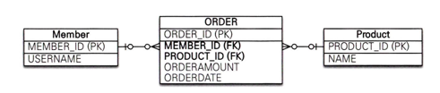
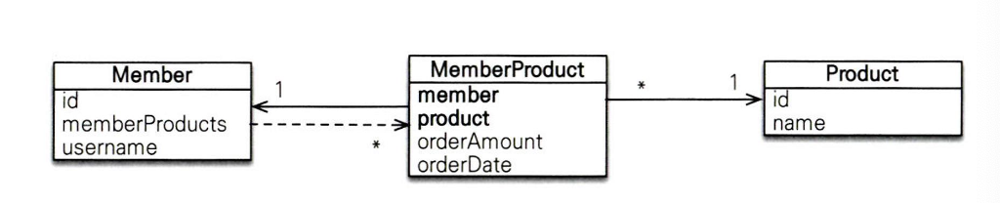
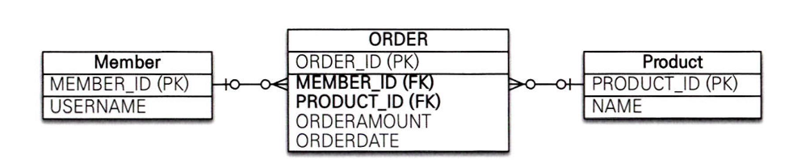

# 6장 정리
### 이번장에서는 다양한 연관관계를 다룬다

연관관계를 매핑할때는 3가지를 고려해야 하는데

- 다중성 (연관관계)
- 단방향, 양방향
- 연관관계의 주인

### 다중성

- 다대일
- 일대다
- 일대일
- 다대다 : 보통 다대일과 일대다 관계를 가장 많이 사용하고 다대다 관계는 실무에서 거의 사용하지 않는다


### 단방향, 양방향

- 테이블은 외래키 하나로 조인을 사용해서 양방향으로 쿼리가 가능하므로 사실상 방향이라는 개념이 없다
- 반면 객체는 참조용 필드를 가지고 있는 객체만 연관된 객체를 조회할 수 있다
- 객체 관계에서 한쪽만 참조하는 것을 단방향 관계, 양쪽이 서로 참조하는것을 양방향 관계라고 한다

### 연관관계의 주인

- JPA는 두 객체 연관관계 중 하나를 정해서 데이터베이스 외래 키를 관리하는데 이것을 연관관계의 주인이라 한다
- 연관관계 주인은 외래키를 가진 가진 테이블이며 mappedBy 속성을 사용하지 않는다


### 다대다

예시 상황 : 회원테이블과 상품테이블

회원들은 여러 상품을 주문하고, 여러 상품들은 회원들에 의해 주문된다

<p align="left">
    
</p>

- 다대다 관계에서는 2개의 테이블만으로는 표현이 불가능하기 때문에 연결테이블을 사용했다

단방향 매핑 - 코드

예시 코드 - Member

```java
@Entity
public class Member { 
		@Id Column(name="MEMBER_ID")
		private String id;
		
		private String username;
		
		@ManyToMany
		@JoinTable(name = "MEMBER_PRODUCT",
                joinColumns = @JoinColumn(name = "MEMBER_ID"),
                inverseJoinColumns = @JoinColumn(name= "PRODUCT_ID"))
		private List<Product> products = new ArrayList<Product>();
		...
}
```

- @ManyToMany로 회원 엔티티와 상품 엔티티 매핑

예시 코드 - Product

```java
@Entity
public class Product {

	@id @Column(name="PRODUCT_ID")
	private String id;
	
	private String name;
	...
}
```

- 여기서 중요한점은 @ManyToMany 와 @JoinTable을 사용해서 연결 테이블을 바로 매핑했다 **(Member_Product) 엔티티 없이 매핑을 완료**
- @JoinTable 의 속성을 사용하였고 속성을 정리하면
    - @JoinTable.name : 연결 테이블을 지정
    - @JoinTable.joinColumn : 현재 방향인 회원과 매핑할 조인 컬럼 정보를 지정
    - @JoinTable.inverseJoinColumns : 반대 방향인 상품과 매핑할 조인 컬럼 지정

### 중간정리 - 헷갈리는점

- 책에서 말하는 Member_Product 엔티티 없이 매핑을 완료했다 이게 무슨 말인가?

  →연결테이블(Member_Product)을 JPA 엔티티 클래스로 직접 만들지 않고 @ManyToMany + @JoinTable 설정만으로 자동으로 매핑되었다는 것이다

- 조금 더 자세하게 설명하자면

  원래라면 다대다는 중간 연결 테이블이 필요하고, 중간 엔티티 테이블 또한 클래스로 만들어서 관리를 해야할것이다

    ```java
    class MemberProduct{
    	@Id
    	@ManyToOne
    	private Member member;
    	
    	@ManyToOne
    	private Product product;
    ```

  이런식으로 연결 테이블이 필요하지만 이를 @ManyToMany + @JoinTable을 통해서 JPA가 내부적으로 연결테이블을 매핑해준 것이다


### 다대다

양방향 매핑 코드

예시코드 product 수정

```java
@Entity
public class Product {

	@Id
	private String id;
	
	@ManyToMany(mappedBy = "products")
	private List<Member> members;
	...
}
```

- 다대다 관계에서도 mappedBy를 사용하여 연관관계 주인을 지정해준다

### 다대다 매핑의 한계와 극복

문제 상황 : 예를 들어 상품주문에 대해서 상품 수량, 날짜와 같은 컬럼이 더 필요하다면 어떻게 해야하는가?

→ Member_Product 테이블에 컬럼을 추가 → @ManyToMany를 사용 불가 → 그럼 해당 컬럼을 어느 테이블에 저장해야하는지? 에 대한 문제가 추가 발생

해결 방법 :

<p align="left">
    
</p>

1. 연결 테이블을 연결 엔티티로 만들고
2. 이곳에 추가한 컬럼들을 매핑한다
3. 매핑 관계를 다대다 → 일대다, 다대일 로 풀어야 한다

### 중간 정리 - 헷갈리는점

왜? 그냥 @ManyToMany + JoinTable을 통해 다대다 매핑을 진행하고 컬럼을 추가해도 추가해서 사용해도 되는거 아닌가?

1. 컬럼을 추가할경우 매핑 전용 테이블에서 주문 수량, 주문 날짜 같은 비즈니스 의미가 있는 데이터를 담는 테이블로 바뀐다

   → 즉 더이상 투명한 매핑테이블이 아닌 도메인 엔티티가 되는것이다

2. 객체 매핑 한계 : @ManyToMany 매핑은 양쪽 엔티티 컬렉션만 관리할 뿐, 중간 테이블 자체의 속성에는 접근할 방법이 사라진다

   → Member.getProducts() 에서 orderAmount, orderDate를 가져올 수 없다

   → 이유는 @ManyToMany는 연결 엔티티를 전혀 노출하지 않기 때문이다

3. 따라서 MemberProduct 엔티티를 승격시켜서 @ManyToOne, @OneTomany로 풀어야 한다

   → 이를 통해서 orderAmount, orderDate 컬럼에 접근이 가능하다


### 예시 코드 수정

- 예시 코드 - Member

```java
@Entity
public class Member {

	@Id @Column(name = "MEMBER_ID")
	private String id;
	
	//역방향
	@OneToMany(mappedBy = "member")
	private List<MemberProduct> memberProducts;
	...
}
```

- 예시 코드 - Product

```java
@Entity
public class Product {

	@Id @Column(name = "PRODUCT_ID")
	private String id;
	private String name;
	...
}
```

- 예시 코드 - MemberProduct 연결 엔티티 추가

```java
@Entity
@IdClass(MemberProductId.class)
public class MemberProduct {

	@Id
	@ManyToOne
	@JoinColumn(name = "MEMBER_ID")
	private Member member;
	
	@Id
	@ManyToOne
	@JoinColumn(name = "PRODUCT_ID")
	private Product product;
	
	private int orderAmount;
	...
}
```

- @IdClass 에 대해서는 다음장에서 설명한다

- 예시 코드 - 식별자 클래스 추가

```java
public class MemberProductId implements Serializable {
	private String member; //MemberProduct.member와 연결
	private String product;//MemberProduct.product와 연결
	
	//hashCode and equals
	
	@Override
	public boolean equals(object o) { ...}
	
	@Override
	public int hashCode() {...}
}
```

### 복합 기본키

- 현재 MemberProduct 엔티티의 경우 Member, Product 테이블의 기본키를 기본키로 사용한다 이를 복합 기본키 라고 한다

### 복합 기본키 특징

- 복합키는 별도의 식별자 클래스로 만들어야 한다
- Serializable을 구현해야한다
- equals와 hashCode 메서드를 구현해야한다
- 기본 생성자가 있어야 한다
- 식별자 클래스는 public이어야 한다
- @IdClass 방법과 @EmbeddedId 방법이 있다

### 식별 관계

- 부모 테이블의 기본키를 받아서 자신의 기본 키 + 외래키로 사용하는 관계를 말한다
- 위의 MemberProduct 테이블이 회원, 상품의 기본키를 받아서 자신의 기본키로 사용함과 동시에 외래키로 사용하므로 식별관계이다

그렇다면 다대다 매핑에서는 항상 복합키로 매핑을 진행하고 식별자 클래스 작업과 Equals, hashCode를 구현해야만 하는가?

### 다대다 : 새로운 기본키 사용(추천 방식)

<p align="left">
    
</p>

- 추천하는 기본키 생성 전략은 데이터베이스에서 자동으로 생성해주는 대리키를 Long값으로 사용하는 것이다
    - 장점은 간편하고 거의 영구히 쓰며 비즈니스에 의존하지 않는다
    - 추가로 매핑시에 복합키를 만들지 않아도 되므로 간단하다

예시 코드 - 주문

```java
@Entity
public class order {

	@Id @GeneratedValue
	@Column(name = "ORDER_ID")
	private Long id;
	
	@ManyToOne
	@JoinColumn(name = "MEMBER_ID")
	private Member member;
	
	@ManyToOne
	@JoinColumn(name = "PRODUCT_ID")
	private Product product;
	
	private int orderAmount;
	...
}
```

- 대리키인 id값을 사용하여 부모 엔티티의 기본키를 외래키 용도로만 사용한다

이렇게만 보면 식별자 클래스와 equals, hashcode 재정의 코드 추가 정도밖에 차이가 안보인다

하지만 조회하는 코드를 살펴보자

### 복합키를 사용할때 조회 코드

```java
public void find() {
	
	//기본 키 값 생성
	1/ 기본 키 값 생성
	MemberProductId memberProductId = new MemberProductId() ;
	memberProductId. setMember ("member1") ;
	memberProduct Id. setProduct ("productA") ;

	MemberProduct memberProduct = em.find (MemberProduct.class,
	memberProductId) ;
	
	Member member = memberProduct.getMember () :
	Product product = memberProduct.getProduct () ;
	
	System.out. println ("member = " + member.getUsername () ) ;
	System.out printin ("product = " + product.getName () ) ;
	System.out println ("orderAmount = " +
			member Product.getOrderAmount ) ) ;
}
```

- 복합키는 항상 식별자 클래스를 통해서 객체에 대한 정보를 가져온다 또한 equals, hashcode를 재정의해서 값 비교를 진행한다

### 대리키를 사용할때 조회 코드

```java
public void find() {

	Long orderId = 1L;
	Order order = em.find (Order.class, orderId) ;
	Member member = order getMember () :
	Product product = order getProduct () ;
	
	System.out. println ("member = " + member.getUsername ()) ;
	System. out.println ("product = " + product.getName () ) ;
	System.out.println ("orderAmount = " + order.getOrderAmount ()) ;
}
```

- 식별자 클래스 사용없이 + 재정의 없이 대리키를 통해서 조회가 가능하다

### 식별 관계와 비식별 관계

식별 관계 : 받아온 식별자를 기본키 + 외래키로 사용

비식별 관계 : 받아온 식별자는 외래키로만 사용하고 새로운 식별자를 추가한다

추천하는 방식은 간단하게 비식별 관계로작성하여 다대다 연관관계를 푼다

### 나만의 정리

- 다대다 매핑일때 @ManyToMany를 통해서 가능하지만 불편한점들이 있다
    - 식별자 클래스 작성, 메서드 재정의를 하여 사용
    - 매핑 테이블에 컬럼 추가시 접근할 방법이 없다
- 따라서 다대다 매핑을 다대일, 일대다 로 풀고 + 대체키를 사용한다

- 식별 관계 : 부모 엔티티 기본키를 자신의 기본키 + 외래키로 사용
- 비식별 관계 : 부모 엔티티 기본키를 외래키로만 사용하고 대체키를 사용