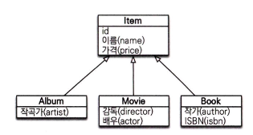
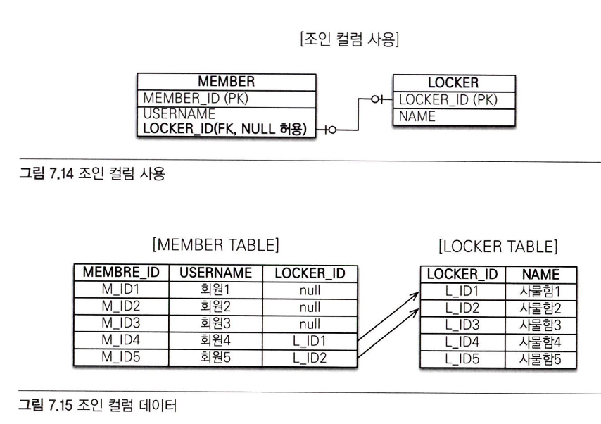

# 7장 정리
### 7장에서는 고급 매핑에 대해 다룬다

여기서 말하는 고급매핑은 다음과 같다

- 상속 관계 매핑
- @MappedSuperclass
- 복합키와 식별 관계 매핑
- 조인 테이블
- 엔티티 하나에 여러 테이블 매핑

## 상속 관계 매핑

- 관계형 데이터베이스에는 객체지향에서 다루는 상속이라는 개념이 없다

  → 대신에 슈퍼타입 서브타입 관계가 객체의 상속 개념과 가장 유사하다


<p align="left">
    
</p>

그림과 같이 슈퍼타입 서브타입 논리 모델을 테이블로 구현할 때는 3가지 방법이 있다

1. 각각의 테이블로 변환 : 모두 테이블로 만들고 조회할때 조인(조인전략)
2. 통합 테이블로 변환 : 테이블을 하나만 사용해서 통합한다(단일 테이블 전략)
3. 서브타입 테이블로 변환 : 같은 서브 타입마다 하나의 테이블을 만든다(구현 클래스 마다 테이블 전략)

### 1.각각의 테이블로 변환(조인 전략)

- 엔티티 각각을 모두 테이블로 만들고 자식 테이블이 부모 테이블의 기본키를 받아서 기본키 + 외래키로 사용하는 전략
- 따라서 조회할때 조인을 자주 사용한다

- 객체는 타입으로 구분할 수 있지만 테이블은 타입의 개념이 없다
    - 따라서 타입을 구분하는 컬럼을 추가해야하는데 예시코드에서는 DTYPE 컬럼을 구분 컬럼으로 사용했다

예시 코드 - Item

```java
@Entity
@Inheritance(strategy = InheritanceType.JOINED)
@DiscriminatorColumn(name = "DTYPE")
public abstract class Item {
	
	@Id @GeneratedValue
	@Column(name="ITEM_ID")
	private Long id;
	
	private String name;
	private int price;
	...
}
```

예시 코드 - Album

```java
@Entity
@DiscriminatorValue("A")
public class Album extends Item {

	private String artist;
	...
}
```

예시 코드 - Item

```java
@Entity
@DiscriminatorValue("M")
public class Movie extends Item {
	
	private String director;
	private String actor;
	...
}
```

### 코드 설명

1. `@Inheritance(strategy = InheritanceType.JOINED)` : 상속 매핑은 부모 클래스에 @Inheritance를 사용해야 한다, 여기서는 조인 전략을 사용하므로 InheritanceType.JOINED를 사용
2. `@DiscriminatorColumn(name=”DTYPE”)` : 부모 클래스에 구분 컬럼을 지정한다
3. `@DiscriminatorValue(”M”)` : 엔티티를 저장할 때 구분 컬럼에 입력될 값을 지정, 여기서는 DTYPE컬럼에 M값이 저장된다

### 조인 전략의 장점

- 테이블이 정규화된다
- 외래키 참조 무결성 제약조건을 활용할 수 있다
- 저장공간을 효율적으로 사용한다

### 조인 전략의 단점

- 조회할때 조인이 많이 사용되므로 성능이 저하될 수 있다
- 조회 쿼리가 복잡하다
- 데이터를 등록할때 INSERT 쿼리를 두번 실행한다

### 2.통합테이블로 변환(단일 테이블 전략)

- 이름 그대로 테이블을 하나만 사용
- 구분 컬럼(DTYPE)으로 어떤 자식 데이터가 저장되었는지 구분
- 조인을 사용하지 않으므로 조회시에 일반적으로 가장 빠르다

예시 코드 - Item

```java
@Entity
@Inheritance(strategy = InheritanceType.SINGLE_TABLE)
@DiscriminatorColumn(name="DTYPE)
public abstract class Item {
	
	@Id @GeneratedValue
	@Column(name="ITEM_ID")
	private Long id;
	private String name;
	private int price;
	...
}
```

예시 코드 - 자식 클래스

```java
@Entity
@DiscriminatorValue("A")
public class Album extends Item {...}
```

### 코드 설명

- `InheritanceType.SINGLE_TABLE` 로 지정하면 단일 테이블 전략을 사용한다
- 테이블 하나에 모든것이 통합되므로 구분 컬럼을 필수로 사용해야 한다

### 단일테이블 전략의 장점

- 조인이 필요없어서 일반적으로 조회가 빠르다
- 조회 쿼리가 단순하다

### 단일테이블 전략의 단점

- 자식 엔티티가 매핑한 컬럼은 모두 null을 허용해야한다
- 단일테이블에 모든것을 저장하므로 테이블이 커질수 있고 → 이로인해 조회 성능이 오히려 느려질 수 있다

### 3.구현 클래스마다 테이블 전략

- 자식 엔티티마다 테이블을 만든다

예시 코드 - Item

```java
@Entity
@Inheritance(strategy = InheritanceType.TABLE_PER_CLASS)
public abstract class Item {
	
	@Id @GeneratedValue
	@Column(name = "ITEM_ID")
	private Long id;
	
	private String name;
	private int price;
	...
}
```

예시 코드 - 자식 클래스

```java
@Entity
public class Album extends Item {...}
```

### 코드 설명

- `InheritanceType.TABLE_PER_CLASS` 를 선택하면 구현 클래스마다 테이블 전략을 사용한다
- 이 전략을 자식 엔티티마다 테이블을 만든다
- 일반적으로 추천하지 않는 전략이다

### 구현 클래스마다 테이블 전략의 장점

- 서브 타입을 구분해서 처리할때 효과적이다
- not null 제약조건을 사용하지 못한다

### 구현 클래스마다 테이블 전략의 단점

- 여러 자식 테이블을 함께 조회할 때 성능이 느리다
- 자식 테이블을 통합해서 쿼리하기 어렵다

## @MappedSuperclass

- 부모 클래스는 테이블과 매핑하지 않고 부모 클래스를 상속 받는 자식 클래스에게 매핑 정보만 제공할때 사용
- 비유를 하면 추상클래스와 비슷하다
- `@Entity`는 실제 테이블과 매핑되지만
- `@MappedSuperclass`는 실제 테이블과는 매핑되지 않는다

예시 코드 - 공통 컬럼

```java
@MappedSuperclass
public abstract class BaseEntity {

	@Id @GeneratedValue
	private Long id;
	private String name;
	...
}
```

예시 코드 - 엔티티 코드

```java
@Entity
public class Member extends BaseEntity {

	//id 상속
	//name 상속
	private String email;
	...
}
```

자식 엔티티들은 상속을 통해 BaseEntity의 매핑 정보를 물려받는다

### @MappedSuperclass 정리

- 테이블과 매핑되지 않고 자식 클래스에 엔티티의 매핑 정보를 상속하기 위해 사용
- 이 클래스를 직접 생성해서 사용할 일은 거의 없으므로 추상 클래스로 만드는것을 권장한다

## 조인 테이블

- 데이터베이스 테이블의 연관관계를 설계하는 방법은 크게 2가지다
    - 조인 컬럼 사용(외래키)
    - 조인 테이블 사용(테이블 사용)

### 조인 컬럼

<p align="left">
    
</p>

- 예시상황은 회원과 사물함으로 회원이 아직 사물함을 사용하지 않을 경우 null값으로 저장된것을 확인할 수 있다
    - 이처럼 외래키에 null을 허용하는 관계를 선택적 비식별 관계라고 한다
- 주의점은 외래키에 null을 허용하므로 회원과 사물함을 조인할때 외부조인(OUTER JOIN)을 사용해야한다 → 만약 외부 조인을 사용하지 않으면 사물함을 사용하지 않는 회원이 조회가 되지 않는 문제가 발생한다

### 조인테이블

<p align="left">
    
</p>

- 조인테이블을 사용하는 방법은 연관관계를 관리하는 조인테이블을 추가하고 여기서 두 테이블의 외래키를 가지고 연관관계를 관리한다
- 조인테이블 방식의 단점은 테이블을 하나 추가해야한다는점이다 → 따라서 관리해야하는 테이블이 늘어나고 회원과 사물함을 조인하려면 조인테이블까지 추가로 조인해야한다

- 따라서 기본은 조인 컬럼을 사용하고 필요하다고 판단이 될때 조인 테이블을 사용하자
- 이때 조인 컬럼은 `@JoinColumn` 으로 매핑하고 조인 테이블은 `@JoinTable` 로 매핑한다

## 나만의 정리

- 상속 관계를 데이터베이스에 매핑하는 방법
    1. @Inheritance(strategy = InheritanceType.JOINED)
    2. @Inheritance(strategy = InheritanceType.SINGLE_TABLE)
    3. @Inheritance(strategy = InheritanceType.TABLE_PER_CLASS)
- 매핑 정보만 상속하는 @MappedSuperclass
- 연관관계를 위해서 평상시는 @JoinColumn
- 다대다와 같은 경우에 조인테이블(@JoinTable)을 사용하고 이때 복합키 사용보다는 대체키를 두는것을 고려해보자

## 궁금점 정리

1. 최근 프로젝트에서 @MappedSuperclass를 사용하여 공통 컬럼인 createdAt, updatedAt을 사용했는데 이 방식또한 상속관계 매핑인건지?
    - 자바 관점에서는 extends를 사용하여 자바 클래스 상속이 맞지만 JPA관점에서 말하는 상속 관계 매핑은 부모 엔티티와 자식 엔티티를 테이블 단위에서 어떻게 매핑할 것인가를 의미한다 둘의 상속에 대해 말하는것이 다르다