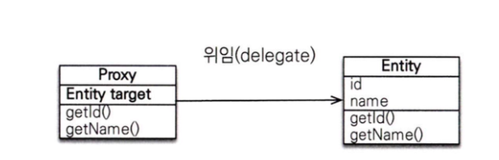
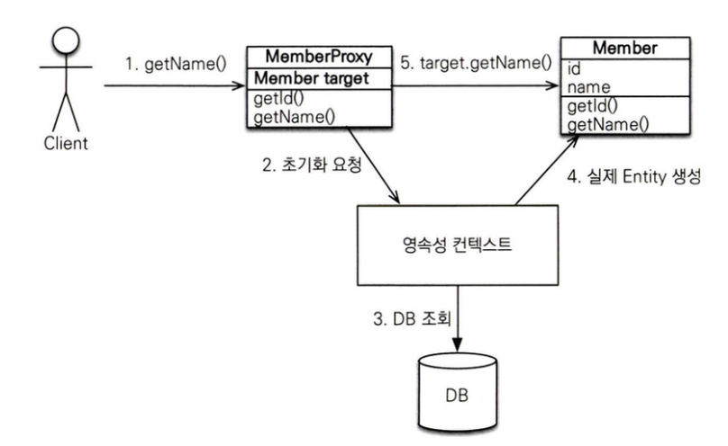

# 8장 정리
### 이 장에서는 프록시와 즉시로딩, 지연 로딩, 영속성 전이에 대해 다룬다

## 프록시

- 예시 코드 - Member

```java
@Entity
public class Member {
	private String username;
	
	@ManyToOne
	private Team team;
	
	public Team getTeam() {
		return team;
	}
	public String getUsername() {
		return username;
	}
	...
}
```

- 예시 코드 - Team

```java
@Entity
public class Team {
	private String name;
	
	public String getName() {
		return name;
	}
	...
}
```

- 비즈니스 로직

```java
//회원과 팀 정보를 출력하는 비즈니스 로직
public void printUserAndTeam(String memberId) {
	Member member = em.find(Member.class, memberId);
	Team team = member.getTeam();
}

//회원 정보만 출력하는 비즈니스 로직
public String printUser(String memberId) {
	Member member = em.find(Member.class, memberId);
}
```

- printUser() 메서드는 회원 엔티티만 사용하므로 em.find()로 회원 엔티티를 조회할때 회사원과 연관된 팀 엔티티까지 함께 조회하는 것을 효율적이지 않다
- JPA는 이런 문제를 해결하기 위해 엔티티가 실제 사용될 때까지 데이터베이스 조회를 지연하는 방법을 제공하는데 이것을 **지연로딩** 이라 한다
- **지연로딩** 기능을 사용하려면 실제 엔티티 객체 대신에 데이터베이스 조회를 지연할 수 있는 가짜 객체가 필요한데 이것을 **프록시 객체**라 한다

### 프록시 기초

EntityManager.getReference() : 엔티티를 실제 사용하는 시점까지 데이터베이스 조회를 미룬다(이때 핵심은 엔티티 자체이다)

<p align="left">
    
</p>

- 프록시 클래스는 실제 클래스를 상속받아서 만들어 지므로 실제 클래스와 겉 모양이 같다 따라서 사용하는 입장에서는 이것이 진짜 객체인지 프록시 객체인지 구분하지 않고 사용하면 된다
- 프록시 객체는 실제 객체에 대한 참조(target)를 보관한다
- 프록시 객체의 메서드를 호출하면 프록시 객체는 실제 객체의 메서드를 호출한다
- 프록시 객체는 member.getName()처럼 실제 사용될 때 데이터베이스를 조회해서 실제 엔티티 객체를 생성하는데 이것을 프록시 객체 초기화라 한다

### 프록시 객체 초기화

<p align="left">
    
</p>

1. 지연로딩(fetch=LAZY)연관관계 혹은 getReference()를 호출하면 JPA는 실제 엔티티 대신 프록시 객체를 반환하고 프록시 객체가 영속성 컨텍스트에 저장되어 있을것이다
2. 이때 프록시 초기화는 실제 필드 접근 시점에 초기화가 진행되는데 프록시의 getter를 호출했을때이다
3. 이때 영속성 컨텍스트의 1차 캐시를 먼저 확인하고 있다면 그 객체로 교체
4. 만약 1차 캐시에 없다면 DB에 조회후 캐시에 저장
5. 이후 조회부터는 진짜 객체

### 정리

- 프록시 객체는 실제 엔티티가 생성되어 있지 않으면 영속성 컨텍스트에 실제 엔티티 생성을 요청하는데 이것을 초기화라 한다
- 프록시 객체 초기화는 getter호출 시점에 일어나고 그때 DB조회 혹은 캐시 조회가 실행된다

## 즉시로딩과 지연로딩

### 즉시 로딩

- fetch 속성을 `FetchType.EAGER`
- 엔티티를 조회할 때 연관된 엔티티도 함께 조회한다

    ```java
    Member member = em.find(Member.class, "member1");
    Team team = member.getTeam(); //객체 그래프 탐색
    ```

- 예시를 보면 member를 조회하는 순간 팀도 함께 조회된다(프록시 객체가 아님)
- 즉 2번의 쿼리를 실행한다

### 여기서 즉시로딩 사용시 주의점이 하나 있다

```java
@Entity
public class Memeber {
	...
	@ManyToOne(Fetch = Fetch.EAGER) //사실 기본값이 즉시로딩이다
	@JoinColumn(name = "TEAM_ID", nullable=false)
	private Team team;
	...
}
```

- 외부 조인 보다는 내부 조인이 성능과 최적화에서 더 유리하다
- 그런데 nullable=false를 설정해서 null값을 허용하지 않는다 라고 선언하면 JPA는 외부 조인 대신에 내부 조인을 사용한다
- 기본이 외부 조인인 이유는 전 장에서 공부했듯이 team이 없는(null) 회원은 내부 조인시 조회가 안되는 문제가 발생하기 때문이다

### 지연로딩

- fetch속성을 `FetchType.LAZY`로 지정한다
- 회원만 조회할대는 team멤버변수에 프록시 객체를 넣어둔다

    ```java
    @Entity
    public class Member {
    	...
    	@ManyToOne(fetch = fetchType.LAZY)
    	@JoinColumn(name = "TEAM_ID")
    	private Team team;
    	...
    }
    ```

- 지연로딩 실행 코드

    ```java
    Member member = em.find(Member.class, "member1");
    Team team = member.getTeam(); //객체 그래프 탐색
    team.getName(); //팀 객체 실제 사용
    ```

1. team멤버 변수에는 getter를 통해 접근전까지 프록시 객체를 사용한다
2. 실제 사용되는 순간 프록시객체를 데이터베이스에서 조회하여 객체를 초기화 한다

## JPA 기본 페치 전략

- @ManyToOne, @OneToOne : 즉시로딩(fetchType.EAGER)
- @OneToMany, @ManyToMany : 지연로딩(fetchType.LAZY)

- JPA의 기본 페치 전략은 연관된 엔티티가 하나면 즉시 로딩, 컬렉션이면 지연로딩을 사용한다
- 컬렉션을 로딩하는 것은 비용이 많이 들고 잘못하면 너무 많은 데이터를 로딩하기 떄문

### 추천하는 방식은 모든 연관관계를 지연로딩으로 사용하고 꼭 필요한 곳에만 즉시로딩을 사용하도록 최적화하면 된다

## 영속성 전이 : CASCADE

- 특정 엔티티를 영속 상태로 만들때 연관된 엔티티도 함께 영속 상태로 만들고 싶으면 영속성 전이를 사용한다
- JPA는 CASCADE옵션으로 영속성 전이를 제공한다
- 영속성 전이를 사용하면 부모 엔티티를 저장 할때 자식 엔티티도 함께 저장한다

상황 : 부모엔티티를 저장할때 자식 엔티티도 같이 저장되게 해보자

예시 코드 - 부모

```java
@Entity
public class Parent {
	...
	@OneToMany(mappedBy = "parent", cascade = CascadeType.PERSIST)
	private List<Child> children = new ArrayList<Child>();
	...
}
```

- 부모를 영속화할 때 연관된 자식들도 함께 영속화하라고 cascade = CascadeType.PERSIST 옵션을 설정했다
- 부모만 영속화하면 CascadeType.PERSIST로 설정한 자식 엔티티까지 함께 영속화해서 저장한다
- 영속성 전이는 연관관계 매핑과 아무런 관련 없다.
- 단지 엔티티를 영속화 할떄 연관된 엔티티도 같이 영속화하는 편리함을 제공할 뿐이다

이번에 즉시 로딩과 지연로딩을 배우며 유명한 문제중 하나인 N+1 문제에 대해서도 알아보게 되었다

## 궁금증 정리

### 1. 지연로딩과 EntityManager.getReference() 같은거 아닌가?

지연로딩에 대한 다시 이해

### 지연로딩

가정 : 이전에 말했듯이 @ManToOne은 기본값이 fetch = EAGER (즉시 로딩상태)일것이다 이때 fetch = LAZY옵션을 건 상태라고 해보자

동작 방식 :

- 엔티티를 조회하면 연관된 엔티티 대신 프록시 객체를 넣어둔다
- 실제로 연관 **객체의 필드**에 접근하는 시점

```java
Member member = em.find(Member.class, 1L); //DB에서는 Member만 조회
Team team = member.getTeam();// 여기까지 프록시 객체
String teamName = team.getName();//이 시점에 Team 조회 SQL 실행
```

- 즉, 연관관계 필드의 조회 시점까지 SELECT를 미루는 전략

### EntityManager.getReference()

가정 : 엔티티 자체를 조회해야 하지만, 실제 DB조회를 당장 하고 싶지 않을때

동작 방식 : em.find()는 즉시 DB에서 SELECT 쿼리를 날리지만 em.getReference(0는 해당 엔티티의 프록시 객체를 반환한다

```java
Member member = em.getReference(Member.class,1L);
System.out.println(member.getClass());
// class jdk.proxy2.$Proxy... 프록시 객체 반환

String name = member.getName();
//이 시점에서 DB조회 발생
```

즉 엔티티 자신을 프록시로 반환해서, 실제 사용시점에 SELECT 실행하는 방식

### 지금 정리하면서도 엥? 둘다 그냥 조회 전까지 프록시 객체를 반환하는점에서 다른게 없는거 아니야? 라고 또 생각이 들었다

차이점을 정리하면 적용대상과, 반환시점에 차이가 있다

| **구분** | **지연 로딩 (Lazy)** | EntityManager.getReference() |
| --- | --- | --- |
| 적용 대상 | 연관관계 필드 | 엔티티 자체 |
| 반환 시점 | 엔티티 조회 시, 연관 객체 대신 프록시 저장 | 아예 find() 대신 프록시 엔티티 반환 |
| DB 조회 시점 | 연관 객체 필드 사용 시 | 프록시 엔티티의 속성 사용 시 |
| 주 용도 | 관계 엔티티를 필요한 순간까지 미루기 | “조회 없이 참조만” 필요할 때 (예: 엔티티 수정/삭제용 FK 참조) |

지연로딩

- 엔티티 A를 find()로 가져올때 연관된 B엔티티는 프록시 객체
- 여기서 만약 B.getName()을 호출하면 SQL 실행
- 핵심 : 연관 객체를 실제 사용할 때까지 미룬다

EntityManager.getReference()

- 엔티티 자체가 대상이 된다
- getReference()는 SELECT를 안한다 → 프록시 엔티티 반환
- 이후 프록시 객체의 필드(member.getName()을 할때 SELECT 실행
- 새로운 Order를 만들때 Member엔티티를 DB에서 SELECT 할 필요는 없고, 단순히 member_id만 매핑하면 될때 사용한다
- 핵심 : 엔티티 자신을 사용할 때까지 미룬다

## 2.왜 CASCADE를 써서 굳이? 영속성 컨텍스트에 저장할까?

예시 코드

```java
Parent p = new Parent();
Child c1 = new Child();
Child c2 = new Child();

p.addChild(c1);
p.addChild(c2);

em.persist(p); //CascadeType.PERSIST
```

여기서 em.persist(p)하나만 호출해도 자식 (c1,c2)까지 영속성 컨텍스트에 등록

### 영속성 컨텍스트에 저장하는 이유

1. 일관된 트랜잭션 단위 관리 : 같은 트랜잭션에서 부모 자식 모두 영속 상태로 관리되기 때문에 동일한 트랜잭션에서 자동으로 반영
2. 변경감지(Dirty Checking) : 트랜잭션 커밋 시점에 변경 여부를 감지해서 UPDATE쿼리르 실행한다 만약 자식이 영속성 컨텍스트에 없다면 변경감지가 불가능하다
3. em.persist(child)를 일일이 호출하지 않아도 객체 그래프 단위의 관리를 지원하기 때문