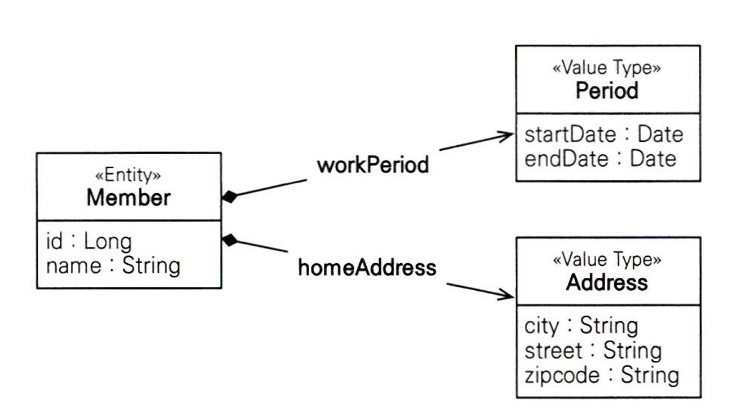
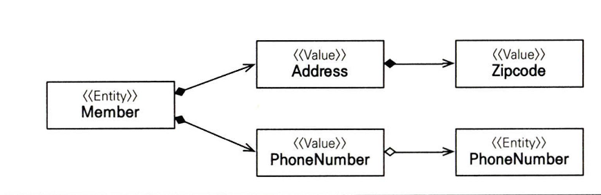

# 9장 정리
### 이번장에서는 값 타입에 대해서 알아본다

JPA의 데이터 타입을 가장 크게 분류하면 2가지이다

1. 엔티티 타입  : @Entity로 정의하는 객체
2. 값 타입 : int, Integer, String 처럼 단순히 값으로 사용되는 자바 기본타입이나 객체

   여기서 값 타입을 3가지로 나눌수 있다

    1. 기본값 타입
        - 자바 기본 타입(int, double…)
        - 래퍼 클래스(Integer…)
        - String
    2. 임베디드 타입(복합 값 타입)
    3. 컬렉션 값 타입

기본값 타입은 이전장까지 쭉 진행해왔다 지금부터 임베디드 타입을 살펴본다

## 임베디드 타입(복합 값 타입)

- 예시 코드 - 기본

```java
@Entity
public class Member {

	@Id @GeneratedValue
	private Long id;
	private String name;
	
	//근무 기간
	@Temporal (TemporalType.DATE) java.util.Date startDate;
	@Temporal (TemporalType.DATE) java.util.endDate;
	
	//집 주소 표현
	private String city;
	private String street;
	private STring zipcode;
	...
}
```

- 현재 엔티티의 정보는 이름, 근무기간, 집 주소를 가지는데 회원이 상세한 데이터를 그대로 가지는 것은 객체지향적이지 않으며 응집력이 떨어진다
- 따라서 근무기간, 집 주소를 임베디드 타입을 적용시켜본다

- 예시 코드 - 임베디드 타입 적용

<p align="left">
    
</p>


```java
@Entity
public class Member {

	@Id @GeneratedValue
	private Long id;
	private String name;
	
	@Embedded Period workPeriod;
	@Embedde Address homeAddress;
	...
}
```

```java
@Embeddable
public class Period {

	@Temporal (TemporalType.DATE) java.util.Date startDate;
	@Temporal (TemporalType.DATE) java.util.Date endDate;
	...
	
	public boolean isWork(Date date) {
		//값 타입을 위한 메서드를 정의
	}
}
```

```java
@Embeddable
public class Address {
	
	@Column(name="city")
	private String city;
	private String street;
	private String zipcode;
	...
}
```

- @Embeddable : 값 타입을 정의하는 곳에 표시
- @Embedded : 값 타입을 사용하는 곳에 표시
- 임베디드 타입은 기본 생성자가 필수다
- UML로 표현하면 컴포지션 관계가 된다

## 임베디드 타입과 연관관계

- 임베디드 타입은 값 타입을 포함하거나 엔티티를 참조할 수 있다

<p align="left">
    
</p>

예시 코드 - 임베디드 타입에 값타입예시, 임베디드 타입에 연관관계 매핑

```java
@Entity
public class Member {
	@Embedded Address address;
	@Embedded phoneNumber phoneNumber;
	...
}

@Embeddable
public class Address {
	String street;
	String city;
	String state;
	@Embeddable Zipcode zipcode;
}

@Embeddable
public class Zipcode {
	String zip;
	String plusFour;
}

@Embeddable
public class PhoneNumber {
	String areaCode;
	String localNumber;
	@ManyToOne PhoneServicePreovider provider;
	...
}

@Entity
public class PhoneServiceProvier {
	@Id String name;
	...
}
```

- 예시코드에서 보이듯이 임베디드 타입은 Zipcode와 같은 값 타입을 포함할 수 있고
- 연관관계 매핑또한 가능한것을 확인할 수 있다

### @AttributeOverride : 속성 재정의

- 임베디드 타입에 정의한 매핑정보를 재정의 하기 위함
- 예시 코드 - 테이블에 매핑하는 컬럼명이 중복되는 상황

```java
@Entity
public class Member {
	
	@Id @GeneratedValue
	private Long id;
	private String name;
	
	@Embedded Address homeAddress;
	@Embedded Address companyAddress;	
}
```

- 예시 코드 - 중복 컬렴명 해결

```java
@Entity
public class Member {
	
	@Id @GeneratedValue
	private Long id;
	private String name;
	
	@Embedded Address homeAddress;
	
	@Embedded
	@AttributeOverrides({
		@AttributeOverride(name="city", column=@Column(name="COMPANY_CITY")),
		@AttributeOverride(name="street", column=@Column(name="COMPANY_STREET")),
		@AttributeOverride(name="zipcode", column=@Column(name="COMPANY_ZIPCODE"))
	})
	Address companyAddress;
}
```

- 해결 방법 : 임베디드 타입을 같은걸 쓰면 중복이 생기므로
- 하나는 그대로 사용
- 다른 하나는 @AttributeOverrides를 사용하여 컬럼명을 재정의하여 사용한다
- 다행히도? 한 엔티티에 같은 임베디드 타입을 중복해서 사용하는 일은 많지 않다고 한다

## 값타입과 불변 객체

컬렉션 값 타입에 대해 알아보기 전에 값 타입과 불변객체에 대해 다시 정리하고 넘어가자

예시 코드

```java
member1.setHomeAddress(new Address("OldCity"));
Address address = member1.getHomeAddress();

address.setCity("NewCity");
member2.setHomeAddress(address);
```

문제 상황

- 회원2에 새로운 주소를 할당할때 회원2만 변경되길 기대했지만 회원1의 주소도 같이 변경되는 문제가 발생한다
- 이렇게 뭔가를 수정했는데 전혀 예상치 못한 곳에서 문제가 발생하는 것을 부작용 이라 한다

다음 예시코드를 살펴보자

```java
member1.setHomeAddress(new Address("OldCity"));
Address address = member1.getHomeAddress();

//회원1의 address 값을 복사해서 새로운 newAddress값을 생성
Address newAddress = address.clone();

newAddress.setCity("NewCity");
member2.setHomeAddress(newAddress);
```

- 이상황의 경우 clone()을 사용했는데 clone()의 기본설정은 얕은 복사이다
- 얕은 복사일 경우에는 주소값이 복사되므로 member1의 city값까지 바뀌는 문제가 여전히 발생한다

해결 방법

- 이런 부작용을 막으려면 값을 복사해서 사용하면 안된다

### 불변 객체

- 객체를 불변하게 만들면 값을 수정할 수 없으므로 부작용을 원천 차단할 수 있다
- 따라서 값 타입은 될 수 있으면 불변 객체로 설계해야한다

불변객체를 만드는 방법중 가장 간단한 방법은 생성자로만 값을 설정하고 수정자를 만들지 않으면 된다

예시 코드 - 불변객체 생성자 방식

```java
@Embeddable
public class Address {
	
	private String city;
	
	//생성자로 초기 값을 설정한다
	public Address(String city) {this.city = city}
	
	//접근자(Getter)는 노출한다
	public String getCity() {
		return city;
	}
	//수정자(Setter)는 만들지 않는다
}
```

- 이처럼 새로운 객체를 생성해서 사용함으로써 부작용이라는 재앙을 막을 수 있다

## 값 타입 컬렉션

예시코드를 먼저 보자

```java
@Entity
public class Member {
	
	@Id @GeneratedValue
	private Long id;
	
	@Embedded
	private Address homeAddress;
	
	@ElementCollection
	@CollectionTable(name="FAVORITE_FOODS",
			joinColumn = @JoinColumn(name="MEMBER_ID"))
	@Column(name="FOOD_NAME")
	private Set<String> favoriteFoods = new HashSet<String>();
	
	@ElementCollection
	@CollectionTable(name="ADDRESS", joinColumns
			= @JoinColumn(name = "MEMBER_ID"))
	private List<Address> addressHistory = new ArrayList<Address>();
	...
}

@Embeddable
public class Address {

	@Column
	private String city;
	private String street;
	private String zipcode;
	...
}
```

- 관계형 데이터베이스의 테이블은 컬럼안에 컬렉션을 넣을 수 없다
- 따라서 하나 이상 컬렉션으로 저장하려면 @ElementCollection, @CollectionTable어노테이션을 사용한다
- → 따라서 별도의 테이블을 추가해야하고 이때 @CollectionTable를 사용해서 테이블을 추가한다
- 마찬가지로 중복컬럼 발생시 @AttributeOverride를 사용하여 재정의 가능하다

### 값 타입 컬렉션의 주의 사항

- 문제 상황 : 값 타입은 식별자라는 개념이 없고 단순히 값들의 모음이므로 값을 변경해버리면 데이터베이스에 저장된 원본 데이터를 찾기 어렵다
- 엔티티 하나에 소속된 값 타입은 값이 변경되면 자신이 소속된 엔티티를 데이터베이스에서 찾고 값을 변경하면된다 하지만 값 타입 컬렉션의 경우 별도의 테이블에 보관된다
- 따라서 여기에 보관된 값 타입의 값이 변경되면 데이터베이스에 있는 원본 데이터를 찾기 어려운 문제가 있다

- 해결방식 : JPA 구현체들은 값 타입 컬렉션에 변경 사항이 발생하면, 값타입 컬렉션이 매핑된 테이블의 연관된 모든 데이터를 삭제하고, 현재 값 타입 컬렉션 객체에 있는 모든 값을 데이터베이스에 다시 수정한다
- 결론 : 따라서 실무에서는 값 타입 컬렉션이 매핑된 테이블에 데이터가 많다면 값 타입 컬렉션 되신 일대다 관계를 고려해야 한다

## 나만의 정리

### 엔티티 타입 과 값 타입

엔티티 타입 특징

- 식별자(@Id)가 있다
- 생명 주기가 있다
    - 생성하고 영속화하고, 소멸하는 생명주기가 있다
    - em.persist(entity)로 영속화
    - em.remove(entity)로 제거
- 공유할 수 있다
    - 참조 값을 공유할 수 있다. 이것을 공유 참조라 한다

### 값 타입의 특징

- 식별자가 없다
- 생명주기를 엔티티에 의존한다
    - 의존하는 엔티티를 제거하면 같이 제거된다
- 불변 객체로 만드는 것이 안전하다(생성자 생성, setter사용x)
- 값 타입은 정말 값 타입이라 판단될때만 사용해야 한다 → 식별자가 필요하고 지속해서 값을 추적하고 구분하고 변경해야 한다면 이건 값타입이 아닌 엔티티다